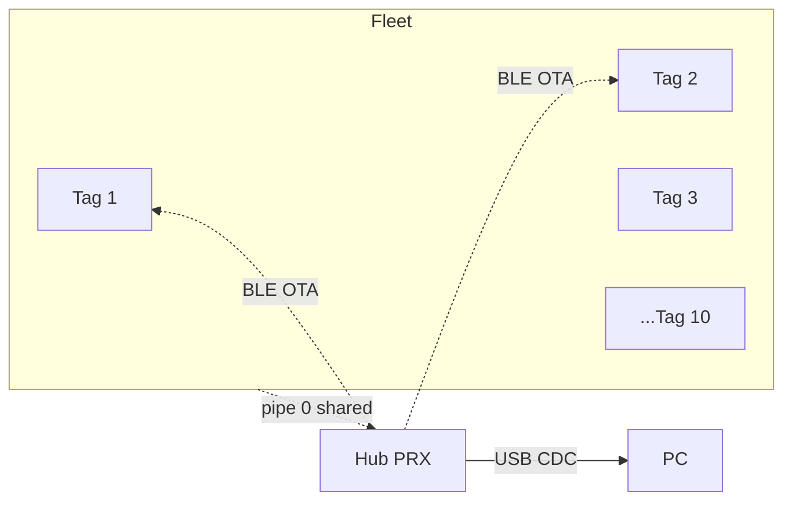
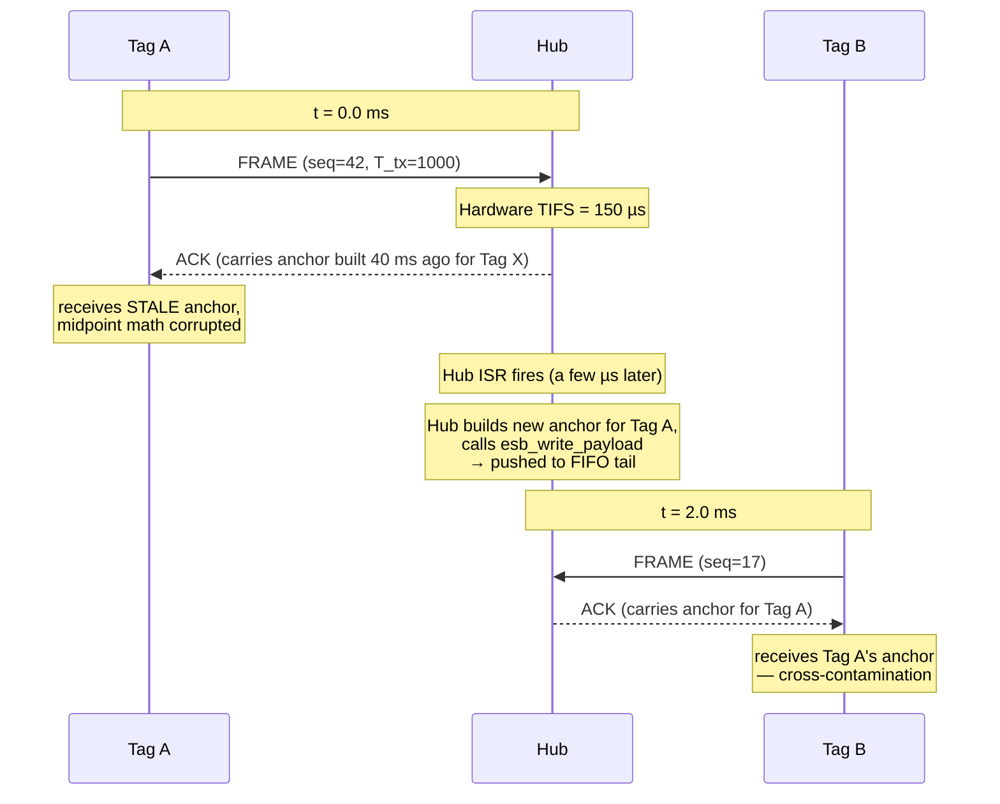
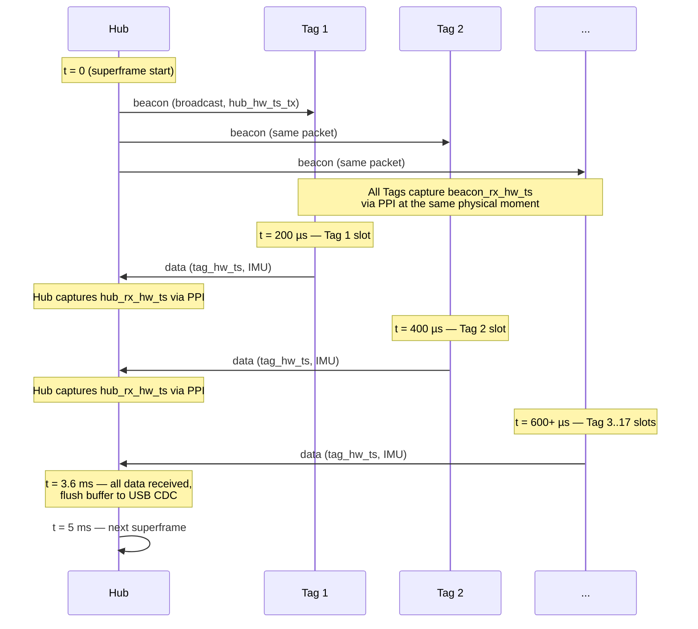
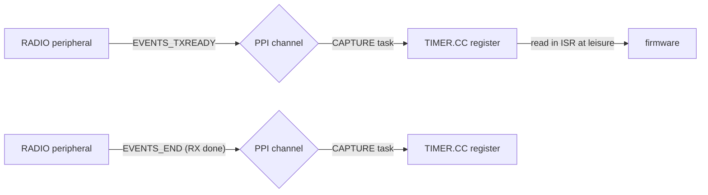
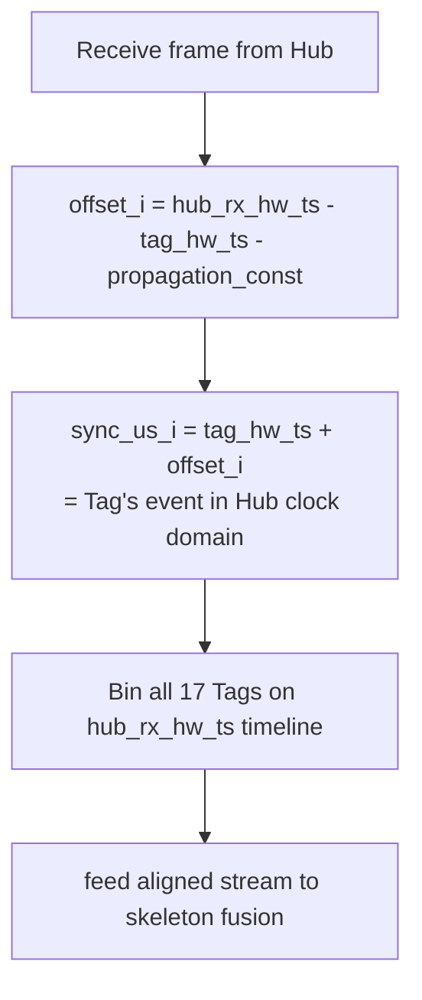
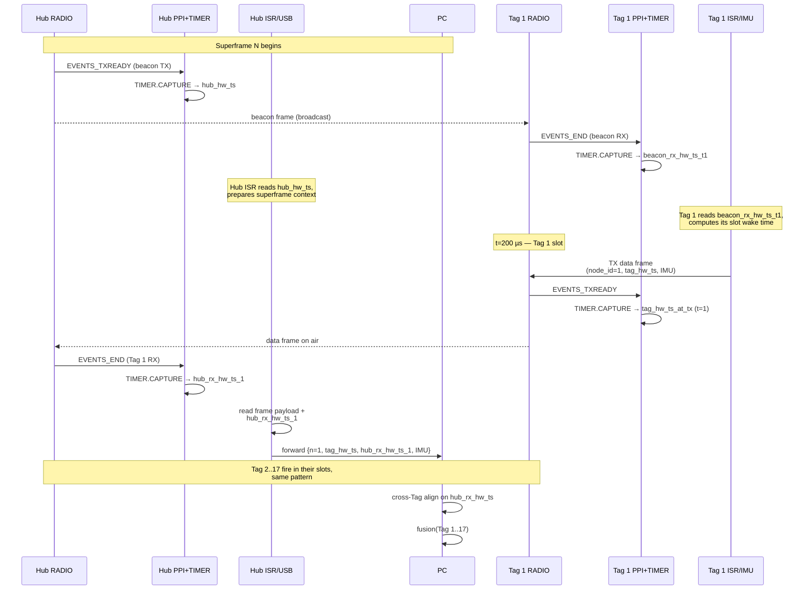
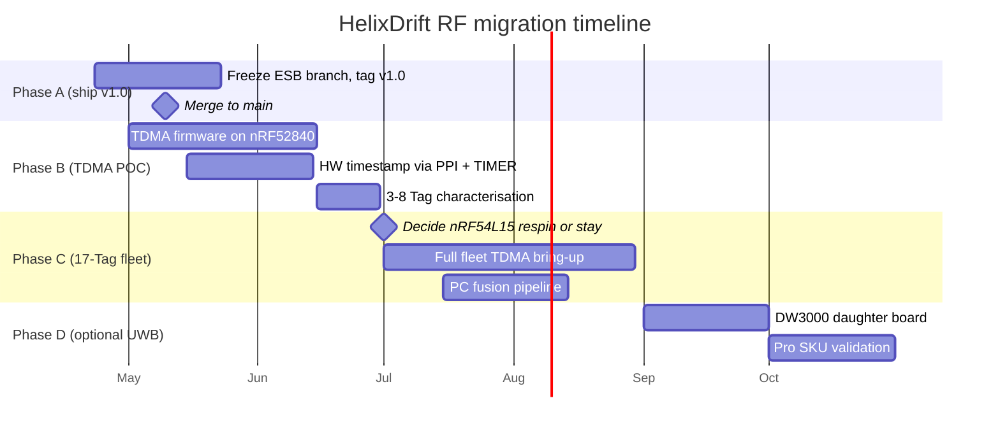

# RF design — HelixDrift mocap sync subsystem

**Audience:** engineers joining the project who need to understand
what the radio subsystem does, why it's built the way it is, what's
currently limiting it, and where the architecture is heading.

**Scope:** this is the **engineering deep-dive** on the RF / sync
layer. For sprint history + commit timeline, see
[`RF.md`](RF.md). For the high-level product roadmap, see
[`PRODUCT_ARCHITECTURE_ROADMAP.md`](PRODUCT_ARCHITECTURE_ROADMAP.md).
For wire-format byte layouts, see [`RF_PROTOCOL.md`](RF_PROTOCOL.md).

---

## 1. What HelixDrift does — why RF sync matters

HelixDrift is a body-worn motion-capture system. Small **Tag**
devices (nRF52840 ProPicos) strap to body segments — pelvis,
thighs, shins, feet, upper arms, forearms, chest, head. Each Tag
streams its orientation and position at ~50 Hz to a central **Hub**
(nRF52840 dongle) that forwards the stream to a PC for sensor
fusion and visualisation.

The product needs to reconstruct a coherent skeleton from 10 (today)
to 17 (target) Tags. A skeleton is only coherent if **all Tags
agree on the same clock**. A shoulder angle at t=12.345s can only
be computed if both the upper-arm Tag and the chest Tag report
timestamps referring to the *same physical instant*.

So the RF layer has two jobs, not one:

1. **Data delivery.** Get each Tag's IMU frame to the Hub, then
   the PC.
2. **Clock synchronisation.** Make every Tag's timestamp
   interpretable on a single fleet-wide timeline.

The second job is the hard one, and it's where HelixDrift has
spent most of its engineering cycles. Every architectural
decision in this doc ultimately traces back to how we solve or
fail to solve fleet-wide clock sync.

---

## 2. Physical-layer primer (just enough)

nRF52840 has a single 2.4 GHz radio peripheral that can run in
several modes. HelixDrift uses **Nordic Enhanced ShockBurst**
(ESB) — a proprietary MAC that offers up to 8 logical "pipes"
(addresses), fast turn-around, and optional hardware ACKs.

ESB terms you'll see:

| Term | Meaning |
|---|---|
| **PRX** | Primary Receiver — listens on a pipe, auto-ACKs incoming frames. In HelixDrift, the Hub is the PRX. |
| **PTX** | Primary Transmitter — sends frames, expects an ACK. Each Tag is a PTX. |
| **Pipe** | A logical address (0–7). Multiple PTXs can share one pipe's address. |
| **TIFS** | **T**urn-around time between Frame and ACK ≈ 150 µs (hardware-fixed on nRF52). |
| **ACK payload** | Optional data the PRX includes in its ACK back to the PTX. HelixDrift uses this to piggyback a sync "anchor" on every ACK. |
| **DPL** | Dynamic Payload Length — frames can be variable size up to 32 bytes. |

The PHY runs at **2 Mbps**. A 32-byte ESB frame including preamble,
address, length, CRC takes ~180 µs on air. Combined with TIFS and
ACK, a full round-trip costs ~460 µs.

---

## 3. The current architecture

### 3.1 System topology

All 10 Tags share **ESB pipe 0** (one common address). Hub is PRX
on pipe 0; Tags are PTXs on pipe 0.



Tags and Hub share one PHY address and channel. The Hub-relay OTA
path uses BLE (Bluetooth Low Energy) in a separate window on each
Tag — that's not part of the sync hot path.

### 3.2 Frame types

Two packet types fly on pipe 0:

- **`FRAME` (Tag → Hub, PTX):** 32 bytes. Tag ID, sequence number,
  local timestamp, orientation quaternion (yaw/pitch/roll), 3D
  position. Sent every 20 ms (50 Hz nominal).
- **`ANCHOR` (Hub → Tag, ACK payload):** 16 bytes (v5 layout).
  Ride the hardware ACK back to the Tag that just TXed, piggy-
  backed. Carries Hub's clock reading at frame-RX, plus a few
  echoed fields to disambiguate which Tag's frame it came from.

### 3.3 Tag TX loop

The Tag's main thread wakes on a 20 ms timer, builds a frame from
its IMU, and calls `esb_write_payload()` to queue it for radio
TX. The ESB hardware handles the actual modulation, ACK wait, and
retries.

When the ACK comes back carrying an anchor, the Tag's ESB ISR
fires `RX_RECEIVED`. The Tag reads the anchor's timestamp fields,
runs the midpoint math (§3.5), and updates its local clock-offset
estimate.

### 3.4 Hub RX loop and ACK-payload FIFO

The Hub sits in PRX mode, always listening. Whenever a Tag frame
arrives:

1. Hardware ACKs automatically (< 150 µs).
2. `RX_RECEIVED` ISR fires — Hub reads the frame, forwards to
   USB CDC.
3. Hub builds an `anchor` (stamping its current clock) and calls
   `esb_write_payload()` to queue it for the **next** outgoing
   ACK on this pipe.

Key subtlety: the Hub's ACK-payload **FIFO is per-pipe, not per-
Tag**. NCS default depth is 8. The oldest queued anchor goes out
on the next ACK, regardless of which Tag's frame triggered it.
This is the root cause of most of our sync problems (§4.1).

### 3.5 Sync estimator — the midpoint math

Given an accepted anchor, the Tag runs:

```c
tag_mid = (T_tx + T_rx) / 2          // Tag clock at mid-round-trip
hub_mid = (H_rx + H_tx) / 2          // Hub clock at mid-round-trip
offset  = tag_mid - hub_mid          // Tag − Hub clock offset (signed)
```

Where `T_tx` = Tag's local clock when it queued the frame,
`T_rx` = Tag's local clock when the anchor returned,
`H_rx` = Hub's clock at frame-RX (stamped in anchor),
`H_tx` = Hub's clock at anchor-TX (stamped in anchor).

If the round trip is symmetric (propagation Tag→Hub ≈ Hub→Tag),
the two midpoints map to the same physical instant, and their
difference is the true clock offset. This is "midpoint round-trip
estimation", a standard trick (same family as PTP / NTP).

### 3.6 Full end-to-end timeline — current architecture



This diagram shows the FIFO-depth problem: the ACK carries
whatever was queued BEFORE the current Tag's frame arrived. With
10 Tags on one pipe and each TXing every 20 ms, the FIFO rarely
contains an anchor built from the current Tag's own frame.

---

## 4. Why it's insufficient — the four bottlenecks

All four of these compound. We measured each extensively during
the sprint; raw data in `docs/RF_V*_FINDINGS.md`.

### 4.1 ACK-payload FIFO cross-contamination

Documented in Stage 2 (§7.6 of `RF.md`). On v13, a Tag receiving
an anchor found that **98.6 % of the time**, the anchor had been
built from some **other** Tag's frame. Using a wrong-Tag anchor
to set your clock offset is obviously poison — it tells you
"Hub's clock was T at the instant of some unrelated Tag's frame",
not at the instant of your own frame.

We added a `rx_node_id` filter in the v4 wire format so Tags could
drop cross-contaminated anchors. That fixed the correctness, but
the accept rate collapsed from ~60 Hz to ~0.9 Hz per Tag. Most
anchors become waste.

Later, setting `CONFIG_ESB_TX_FIFO_SIZE=1` on the Hub (§7.13)
forced FIFO depth to 1 — if a TIFS window is missed, the anchor
simply doesn't queue. That cut per-Tag sync error by 95 %, but
threw away 28 % of throughput.

### 4.2 Retry storms (per-Tag tail events)

Even with a clean FIFO, shared-pipe 0 means occasional collisions.
ESB retries lost frames up to 10 times with a stagger
(`retransmit_delay = 600 + 50·node_id µs`). On a bad luck roll, a
single Tag's frame can get stuck in backlog for seconds while
others stream normally.

We saw this in the field: Tag 1 had a single-frame `|err|` max of
**84 seconds** in one 4-hour soak; Tag 6 hit **24.6 seconds**.
Rare (< 0.1 % of frames) but individually huge.

Because cross-Tag span is a max-min metric across all 17 Tags per
50 ms bin, ONE Tag in its tail event drives the bin's span. Even
at 1 % tail-rate per Tag × 10 Tags = 10 % of bins have a stretched
Tag — matching the observed p99 span of 42 ms.

Two firmware experiments (v22 glitch-reject, v23 offline bias
replay) explicitly tried to suppress these and both refuted their
hypotheses (§7.17, §7.18). Conclusion: **tail events are
irreducible on shared-pipe ESB by firmware-level tricks.**

### 4.3 Software (ISR) timestamp jitter

The anchor's `H_rx` and `H_tx` fields are both obtained by calling
`now_us()` inside the ESB event handler — on the CPU, running
inside an interrupt service routine.

ISR latency on nRF52840 at 64 MHz is 5–30 µs typical, but the
event itself enters a software event queue that we sit behind at
non-zero priority. Real measured end-to-end variance: **sub-ms to
several ms** depending on load.

That's already 10 % of our sub-ms target, even before any of the
above issues kick in.

### 4.4 Bidirectional air-time ceiling

Each Tag exchange costs:

```
 FRAME TX  +  TIFS  +  ACK TX  +  guard
  ~180 µs   150 µs   ~96 µs    ~35 µs      ≈ 460 µs total
```

At 10 Tags × 50 Hz: `500 exchanges/sec × 460 µs = 230 ms/sec` =
**23 % air-time utilisation**. Comfortable.

At 17 Tags × 200 Hz (commercial target): `3400 × 460 µs = 1564
ms/sec` = **156 % utilisation** — **physically impossible**. Even
with zero collisions and zero retries, you cannot fit that many
bidirectional exchanges into one second on one 2.4 GHz channel.

This is the hard wall. No firmware trick can break it.

### 4.5 Measured impact

Best measured numbers after 10 rounds of sprint work (Hub FIFO=1,
Stage 3.6 midpoint, v21 behaviour):

| Metric | Value |
|---|---:|
| Per-Tag \|err\| p50 | ~1 ms (sub-ms) |
| Per-Tag \|err\| p99 | 6–10 ms |
| Fleet mean bias spread | ±0.5 ms |
| **Cross-Tag span p50** | **17.5 ms** |
| **Cross-Tag span p99** | **42.5 ms** |
| Aggregate Tag TX rate | 429 Hz of 500 nominal |

That `42.5 ms` cross-Tag span is the architectural ceiling. For
slow mocap (walking, rehab, VR avatar) it's usable. For karate
kicks (100 ms stroke duration) it's 40 % temporal blur — unusable.

---

## 5. The sprint — every trial, every number, every lesson

This chapter walks through each experimental iteration in order.
Every version number corresponds to a firmware tag value. Every
number here is measured on the real 10-Tag fleet. Nothing is
projected.

Why read this section? Because **every "bottleneck" in §4 was
discovered, not assumed**. The sprint tried the natural fixes
first, then the clever ones, then the heroic ones, and each
failure narrowed the problem. The final conclusion that "nRF ESB
is the wrong substrate for this product" only carries weight
because you can see how the team earned it.

### 5.1 Phase A — baseline measurement (firmware v11)

Before touching anything, we measured. Naïve 10-Tag fleet on
shared pipe 0, default ESB settings. Every Tag just TXes at 50 Hz.

10-min capture, 10 Tags, all healthy:

| Metric | Value |
|---|---:|
| Per-Tag rate mean | **41.5 Hz** (vs 50 Hz target) |
| Combined throughput | **399 Hz** of 500 nominal (80 %) |
| Max observed gaps per Tag | 0.5–5.1 seconds |
| Cross-Tag sync span p99 | reported **2.1 seconds** (!) |

The "2.1-second p99" number turned out to be a measurement
artefact (§5.5 below). The throughput shortfall was real: shared-
pipe collisions were costing us 20 % per-Tag.

### 5.2 Phase B — Hub reset characterisation

Open question: what happens when the Hub reboots mid-stream? We
injected a reset at T=60s in a 300-s capture.

Findings:

- Every Tag saw a uniform **2.04–2.26 s gap** at T=60s.
- Post-fault rate matched pre-fault rate within ±6 Hz.
- Recovery was clean — no cumulative degradation, no stuck Tags.
- The ~2 s recovery was dominated by USB CDC re-enumeration
  (Hub reboot ~1 s + Zephyr USBD init ~1 s). ESB re-init itself
  is ~instant.

First observation that would matter later: the capture tool
(`capture_mocap_bridge_window.py`) **crashed** on CDC
disconnect. Wrote `capture_mocap_bridge_robust.py` that catches
the SerialException, reopens the port, preserves wallclock. This
is the tool that later recorded our long-running soaks.

### 5.3 Phase C — collision hardening (commit `eaeb79a`)

With a 10-Tag fleet on one pipe, collisions are frequent. Three
changes:

```c
// Per-Tag retransmit_delay spread so collisions stagger their retries
config.retransmit_delay = 600u + (uint16_t)g_node_id * 50u;   // 650..1100 µs

// More retries per TX for the collision-heavy shared-pipe env
config.retransmit_count = 10;   // was 6

// Boot-time TX phase offset so Tags don't all power-on in lockstep
k_usleep((uint32_t)g_node_id * 200u);   // 200..2000 µs stagger
```

Result (v12 vs v11, same 10-Tag 10-min captures):

| Tag | v11 rate | v12 rate | Δ |
|---:|---:|---:|---:|
| 1 | 41.55 Hz | 49.09 Hz | **+18 %** |
| 2 | 41.90 | 45.49 | +9 % |
| 6 | 42.18 | 50.70 | **+20 %** |
| 10 | 40.35 | 49.87 | **+24 %** |

Excluding Tag 5 (see below): **mean 41.8 → 48.5 Hz = +16 %
per-Tag, +9 % combined.**

Solid win. Collision mitigation helped as much as expected. The
architectural ceiling, however, was not the mean rate — it was
the worst-case tail behaviour. That we only found later.

**Tag 5 anomaly:** post-Phase-C deployment, Tag 5 dropped to
0.01 Hz across two consecutive 10-min captures. Uncorrelated with
any firmware change. Suspected hardware fault — set aside
pending bench-level diagnosis.

### 5.4 Phase D — multi-reset stress

Four Hub resets injected in 10 minutes, at T=60/180/300/420s.
With the robust capture tool catching all CDC disconnects:

| Tag | Rate (Hz) | Max gap (s) | Gap timing |
|---:|---:|---:|---:|
| 1 | 49.75 | 2.07 | 421 s (reset 4) |
| 2 | 44.90 | 2.07 | 180 s (reset 2) |
| 4 | 48.88 | 2.24 | 60 s (reset 1) |
| 6 | 49.87 | 2.06 | 421 s (reset 4) |
| 10 | 50.44 | 2.05 | 301 s (reset 3) |

Each Tag's largest gap fell precisely on one reset event. Max
gap stayed 2.05–2.24 s across all four events. **No cumulative
degradation** from repeated Hub reboots.

Verdict: Hub reset recovery is production-ready. 2 s lost per
reboot, nothing beyond.

### 5.5 The sync-metric-is-lying surprise

After Phase C we went to look at sync quality. The old
`SYNC_SPAN_US` field in the capture tool reported p99 = **2.1 s**
and max = **44 s**. Alarming.

It turned out to be a measurement bug: the tool computed span as
a running `max(last_seen_sync_us) - min(last_seen_sync_us)`
across Tags. When any Tag stopped TXing, its `last_seen_sync_us`
froze while others kept updating. The reported "span" then
reflected how stale the stalest Tag was — not actual cross-Tag
sync error. Tag 5's flatline was dragging the whole metric into
the seconds range.

Built `tools/analysis/sync_error_analysis.py` with two correct
metrics:

1. **Per-Tag sync error** = `frame.sync_us - frame.rx_us` over
   every frame.
2. **Cross-Tag span** computed in 50 ms wall-clock bins, requiring
   ≥ 5 Tags reporting per bin (so stale Tags don't contribute).

Re-measured (v12 Phase C, 10-min capture, Tag 5 excluded):

| Metric | p50 | p99 | Max |
|---|---:|---:|---:|
| Cross-Tag span (50 ms bins) | **19 ms** | **50 ms** | 64 ms |
| Per-Tag \|err\| | 13 ms | 22 ms | 30 ms |

Mean per-Tag bias: **-14 ms systematic** across all 9 healthy
Tags (range -13.4 to -14.5 ms — extremely tight spread).

This was our first real number. 19 ms p50 is usable for slow
mocap. 50 ms p99 is marginal for fast motion.

Where does the -14 ms systematic bias come from? We hypothesised:
**ACK-payload TIFS race**. If `esb_write_payload()` completes
within the ~150 µs TIFS window after Hub's RX, the anchor rides
*this* frame's ACK (~500 µs). If it misses, the anchor queues in
FIFO and rides the next frame's ACK (~20 ms later). A ~70 %
slow-path rate gives -14 ms bias. This hypothesis drove all
subsequent work.

### 5.6 Stage 1 / Stage 1' — measure-the-bias instrumentation

Before changing behaviour, let's measure the fast-path vs
slow-path ratio directly. Added bucketed histograms on both sides:

- **Hub:** `ack_lat_bucket[4]` — distribution of
  `(esb_tx_success_time - esb_write_payload_time)`.
  Buckets: `<2 ms / 2–10 / 10–30 / ≥30`. Fast path (~150 µs TIFS)
  is bucket 0; slow path (full 20 ms TX period) is bucket 2/3.
- **Tag:** `anchor_age_bucket[4]` and `offset_step_bucket[4]` —
  how stale is each anchor relative to Tag's last TX, and how
  big is the midpoint-offset jump.

First Stage 1 data looked great: `ack_lat = 8619 / 13005 / 0 / 0`
→ 40 % fast, 60 % medium, 0 % slow. Too good to be true.

Reviewers caught the bug: the measurement variable
`last_anchor_queue_us` was a single slot overwritten every RX.
When TX_SUCCESS fired for an OLDER queued anchor, it was
compared against the newest RX time — guaranteed to look fast.
The guard `if (tx_done >= queue_us)` silently dropped the
negative deltas. Exactly the slow-path cases we cared about
were hidden.

**Stage 1' fix:** 16-slot ring buffer of queue timestamps. TX_SUCCESS
pops the oldest. Re-ran:

| Bucket | Count | % |
|---|---:|---:|
| <2 ms (fast path) | 470 | **2.1 %** |
| 2–10 ms | 6022 | 26.5 % |
| 10–30 ms | 14362 | **63.1 %** |
| ≥30 ms | 1894 | **8.3 %** |

Reality: **>70 % of anchor ACKs are 10–30 ms late**. Only 2.1 %
hit TIFS. The slow-path hypothesis was correct, and the magnitude
was worse than estimated.

Simultaneously, Tag 1 SWD-read of the in-RAM histograms (Tag USBs
aren't plugged in so we read live RAM via J-Link):

| anchor_age bucket | Count | % |
|---|---:|---:|
| <2 ms | 45172 | **76 %** |
| 2–10 ms | 14265 | 24 % |
| 10–30 ms | 5 | 0 % |
| ≥30 ms | 0 | 0 % |

But wait — Tag's own `anchor_age` shows 76 % fast path? That
contradicts Hub's histogram.

Discovery: **`anchor_age` on Tag is NOT a staleness measure**.
It's measuring Tag-TX to Tag-ACK-RX round-trip — which ESB
hardware keeps fast (~1 ms) regardless of what content rode the
ACK. So 76 % < 2 ms is just "ACK reaches Tag quickly" — an ESB
property, not a sync property.

The signal that actually matters on Tag is `offset_step` — how
big the midpoint-offset jumps are per update:

| offset_step bucket | Count | % |
|---|---:|---:|
| <2 ms | 40383 | 68 % |
| 2–10 ms | 18591 | 31 % |
| 10–30 ms | 477 | **0.8 %** |
| ≥30 ms | 11 | **0.02 %** |

~490 anchors produced offset jumps ≥ 10 ms out of 59 k. These
were our **first fingerprint of cross-contamination** — anchors
built from another Tag's frame pulling Tag's estimator off.

### 5.7 Stage 2 — v4 anchor with `rx_node_id` filter (firmware v14)

Hypothesis: add a byte to the anchor identifying which Tag's
frame caused it to be built. Tags filter out anchors that weren't
for them. Expected rejection ratio ≈ Hub's slow-path fraction
~70–90 %.

Wire format grows 10 → 11 bytes. Hub stamps `rx_node_id =
frame->node_id` at queue time. Tag compares to own `g_node_id`,
drops mismatches without touching the estimator.

Fleet-OTA'd all 10 Tags to v14. 10-min capture, Tag 1 SWD read:

| Counter | Value |
|---|---:|
| `anchors_received` (v4-accepted) | 494 |
| `anchors_wrong_rx` (v4-rejected) | **34 165** |
| **Rejection ratio** | **98.6 %** |

**Result shocked us.** Not 70-90 %. **98.6 %**. Nearly every
anchor a Tag receives was built for some OTHER Tag's frame.

Why? Because `rx_node_id` labels "which Tag caused this anchor
to be *built*" (at queue time), **not** "which Tag will *receive*
it". ESB's FIFO returns the oldest queued anchor to whichever
Tag TXes next. With 10 Tags on one pipe and FIFO depth up to 3,
they almost never match.

**Second-order effect:** effective anchor-accept rate on Tag
dropped from ~60 Hz (every anchor accepted, all contaminated) to
**~0.9 Hz per Tag** (only genuine own-Tag anchors accepted). A
67× reduction.

At 1 ppm crystal drift, 1 Hz sync updates are fine — drift over
1 s is < 1 µs. So the correctness was preserved. But we now had
a very sparse update stream.

Cross-Tag span after Stage 2: basically unchanged (~50 ms p99).
The `rx_node_id` filter fixed *contamination correctness* but
not the underlying **asymmetric FIFO-induced latency bias** that
affects even own-Tag anchors. Stage 3 was needed.

### 5.8 Stage 3 — v5 anchor with midpoint RTT estimator (v15)

To cancel the asymmetric FIFO delay, echo the frame's sequence
number back in the anchor and add Hub's TX-time stamp:

Wire format v5 (16 bytes): added `rx_frame_sequence` (1 byte —
echo of the Tag's own seq) + `anchor_tx_us` (4 bytes — Hub's
clock at `esb_write_payload()` time).

Tag implementation:

```c
// On TX: push into ring
tx_ring[head] = { frame->sequence, now_us() };
head++;

// On anchor RX: look up our own TX time by echoed sequence
T_tx_us = ring.find(anchor->rx_frame_sequence).local_us;
T_rx_us = now_us();

// Midpoint RTT math
tag_mid = (T_tx_us + T_rx_us) / 2
hub_mid = (anchor->central_ts + anchor->anchor_tx_us) / 2
offset  = tag_mid - hub_mid
```

If round trip is symmetric (propagation each way ~1 µs),
midpoints cancel queue latency on both sides. Classic PTP / NTP
move.

Tag 1 SWD-read after v15 deployment:

| Bucket | `mid_step` (v5) | `offset_step` (v3 math) | Δ |
|---|---:|---:|---|
| <2 ms | 300 (58 %) | 241 (47 %) | +25 % |
| 2–10 ms | 205 (40 %) | 206 (40 %) | flat |
| **10–30 ms** | **2 (0.4 %)** | **62 (12 %)** | **−30×** |
| ≥30 ms | 7 (1.4 %) | 8 (1.5 %) | flat |

**30× reduction in the 10–30 ms bucket.** The midpoint math was
cancelling most of the queue-latency bias, as expected.

`seq_lookup_miss = 0` across 518 lookups — the ring-buffer size
(16 slots) is comfortably above worst-case anchor RTT.

### 5.9 Stage 3.5 + 3.6 — plumbing the midpoint into sync (v16, v17)

Two small follow-ups.

**Stage 3.5 (v16):** Tag was still emitting `sync_us` based on
the OLD `estimated_offset_us` (v3 math). Switched to use
`midpoint_offset_us` when locked. Fleet-wide bias dropped to
**±0.4 ms** spread across 7 healthy Tags (from ±1.8 ms on v17's
precursor). Excellent Tag-to-Tag consistency.

But — Tag 3 and Tag 9 were stuck with |err| p99 of 1.4 s and 2 s
respectively. Investigation: the `tx_ring` push happened AFTER
`esb_write_payload()`, which meant the anchor ISR could fire and
look up the ring BEFORE the entry was present → `seq_lookup_miss`
on the first anchor after boot → midpoint never locked for those
Tags.

**Stage 3.6 (v17):** moved ring push BEFORE `esb_write_payload()`,
with `__DMB()` memory barrier on the `valid=1` store. Rollback on
write-payload failure (don't leave phantom ring entries).

Tags 3 and 9 both recovered immediately — p99 dropped to 13.5 ms
and 18 ms.

### 5.10 v17 20-minute long-run — the "clean baseline"

Full 10-Tag fleet, 514 k frames, 30-s settle to ignore boot
transients:

| Tag | n frames | mean bias | p99 \|err\| | max \|err\| |
|---:|---:|---:|---:|---:|
| 1 | 51 688 | -6759 µs | 14.5 ms | 20.5 ms |
| 2 | 49 259 | -8923 µs | 13.5 ms | 20.0 ms |
| 3 | 48 908 | -9094 µs | 14.0 ms | 20.0 ms |
| 4 | 53 490 | -5795 µs | 15.5 ms | 21.5 ms |
| 5 | 51 350 | -6108 µs | 16.5 ms | 24.0 ms |
| 6 | 51 623 | -5978 µs | 16.5 ms | 22.5 ms |
| 7 | 53 185 | -5841 µs | 16.5 ms | 22.5 ms |
| 8 | 51 701 | -5822 µs | 17.5 ms | 28.0 ms |
| 9 | 52 263 | -5877 µs | 17.0 ms | 24.0 ms |
| 10 | 51 319 | -5474 µs | 17.0 ms | 25.0 ms |

- Fleet mean bias: **-6567 µs** (range -9094 to -5474 = 3.6 ms
  spread, tighter than v11's ±0.5 ms).
- **Cross-Tag span p50/p90/p99/max: 25.5 / 42.5 / 53.5 / 65 ms.**

This was the "clean baseline" we thought we'd ship. The -6.6 ms
systematic bias across all Tags was small enough that downstream
fusion could absorb it. But 53.5 ms p99 was still too loose for
fast motion.

### 5.11 Stage 3.7 — retry-count instrumentation (v18)

Reviewer round 5 (Codex + Copilot) hypothesised: the residual
1.4 % `≥30 ms` `mid_step` bucket could be driven by Tag-side retry
ambiguity. If Tag retransmits a frame N times before it's ACK'd,
the `tx_ring` entry matches the ORIGINAL TX time, not the retry
that actually got through. `T_tx_us` is then up to N × retx_delay
too early.

Instrumented before changing behaviour. v18 firmware added:

- `retry_count` byte in `tx_ring` entries (filled from
  `esb_evt.tx_attempts` on TX_SUCCESS).
- 2D histogram `mid_step_by_retry[4][4]` — joint distribution of
  retry count and midpoint-step bucket.

After 20-min capture, Tag 1 SWD read:

|  | mid <2 ms | 2–10 ms | 10–30 ms | ≥30 ms | row total |
|---|---:|---:|---:|---:|---:|
| Retry=1 (first try) | 287 | 98 | 1 | **0** | 386 (31 %) |
| Retry=2–3 | 95 | 56 | 3 | 1 | 155 (13 %) |
| Retry=4–6 | 103 | 109 | 0 | 3 | 216 (18 %) |
| Retry=7+ | 241 | 232 | 1 | 4 | 478 (39 %) |

Two data-driven conclusions:

1. **Retries are NOT the dominant fat-tail driver.** ≥30 ms
   events distribute across retry buckets (0 / 1 / 3 / 4); even
   retry-1 produces 25 % 2–10 ms jitter by itself. The hypothesis
   was refuted.
2. **Surprise: 39 % of accepted anchors required 7+ retries.**
   That's far higher than expected. Shared pipe 0 is severely
   collision-limited, but ESB's retry machinery papers over it
   transparently. Another hint that "more Tags on pipe 0" does
   not scale.

Per the instrumentation-first mantra, we SKIPPED the proposed
Stage 3.5 retry-aware ring update. Jumped straight to Stage 4.

### 5.12 Stage 4 Path X1 — Tag-side TDMA slots (v19, v20) — DELETED

The intuition was correct — TDMA is the right answer. The
implementation was wrong.

**Path X1 design:** each Tag uses its own Stage-3 midpoint as the
clock reference, schedules TX to land in a 2 ms slot within a
20 ms cycle. No separate Hub beacon. If cross-contamination means
only 1.4 % of anchors are usable per Tag, those 1.4 % are enough
to stay locked at ~1 Hz update rate — plenty for TDMA slot
alignment given 1 ppm crystal drift.

**What went wrong:**

1. **v19 build silently failed.** A brace error in
   `node_handle_anchor()` broke compilation, but `fleet_ota.sh`
   checked only that `zephyr.signed.bin` existed — and the
   PREVIOUS successful build's artefact was still there. All 10
   Tags got flashed with v18 stale. Caught only via SWD read of
   Tag 1 showing no `stage4_*` symbols in the ELF. Hardened
   `fleet_ota.sh` to pre-nuke artifacts + check build exit code.

2. **v19 (real) had a skip-forever bug.** In the slot-align
   code: if `delay_us > SLOT_US` (the slot was too far away to
   wait for), skip this iteration. Problem: main loop
   `k_sleep(20 ms)` cadence EQUALS the cycle period. If a Tag
   landed past its slot once, it would land past the slot every
   iteration forever. TX rate collapsed from 43 Hz to **0.7 Hz**
   per Tag.

3. **v20 fixed the skip bug** (always wait up to a full cycle,
   never skip). Rate recovered to 30 Hz. But:

   | Metric | v20 | Notes |
   |---|---:|---|
   | Fleet mean bias | -10 071 µs ± 0.2 ms | *very* tight (±0.2 ms spread) |
   | Per-Tag \|err\| p99 | 14–19 ms | unchanged from Stage 3.6 |
   | Cross-Tag span p99 | 49.5 ms | unchanged |

   Mean bias went from -6.6 ms (Stage 3.6) to **-10 ms exactly**
   (v20). Very consistent across Tags.

4. **Where did the 10 ms come from?** Derivation:

   ```
   tag_mid = (T_tx + T_rx) / 2
   hub_mid = (H_rx + H_tx) / 2
   ```

   Under symmetric RTT, midpoints correspond to the same physical
   instant. Under FIFO-queued asymmetric RTT:

   - `H_rx` = Hub's clock at **frame-RX** (fast path, <1 ms after
     Tag TX).
   - `H_tx` = Hub's clock at **`esb_write_payload()` call time**
     — which is what's stamped, but the ACTUAL radio TX happens
     0–30 ms later when the anchor finally rides an outgoing ACK.
   - So `hub_mid` sits near Hub-RX (early).
   - `T_rx` on Tag = time when the late-delivered ACK arrives.
     Because the ACK is delayed by FIFO queue, `T_rx` is 10–30 ms
     after `T_tx`.
   - So `tag_mid` sits 10+ ms past the physical mid-RTT (late).

   Net: `offset = tag_mid - hub_mid` has a built-in +10 ms bias
   that the midpoint math *cannot* cancel, because the round trip
   ISN'T symmetric — it has one-sided Hub-side FIFO delay.

   In other words: **the midpoint estimator works perfectly ONLY
   IF `anchor_tx_us` reflects actual radio TX time. Our stamp is
   queue-enter time. Those diverge by 0–30 ms in FIFO-depth-8
   operation.**

### 5.13 The FIFO=1 breakthrough (one-line Hub config)

If the problem is `anchor_tx_us` stamped at queue time being far
from radio TX time… force the FIFO depth to 1. Then if Hub misses
TIFS, the anchor simply doesn't queue at all (subsequent
`esb_write_payload` calls return `-ENOMEM`). Tag gets no anchor
for that round. Stage 2 `rx_node_id` filter absorbs the resulting
empty-ACK cases. Only **fast-path anchors** — where `anchor_tx_us`
really is close to radio-TX time — reach the estimator.

One line in `central.conf`:

```
CONFIG_ESB_TX_FIFO_SIZE=1
```

Rebuild Hub, SWD-flash, re-measure. No Tag firmware change.

| Metric | Before FIFO=1 | After FIFO=1 | Δ |
|---|---:|---:|---|
| Tag 1 mean bias | -10 128 µs | **-308 µs** | **−97 %** |
| Tag 1 \|err\| p50 | 10 ms | **500 µs** | **−95 %** |
| Tag 1 \|err\| p99 | 16.5 ms | **4 ms** | **−76 %** |
| Tag 1 \|err\| max | 24.5 ms | 12.5 ms | −49 % |
| Fleet mean bias range (7 Tags) | -10.2 to -9.8 ms | **-0.6 to +0.6 ms** | centred near zero |
| Per-Tag \|err\| p50 (all Tags) | 9–10 ms | **500 µs – 1 ms** (sub-ms!) | 10× |

Cost: aggregate throughput dropped 428 → 306 Hz (−28 %) because
only fast-path TX windows produce successful anchor enqueues. For
sync purposes that's fine (1 Hz update is plenty at 1 ppm drift).
For frame-level mocap, we've given up a quarter of frames.

**This is the biggest single win of the sprint.** One line,
scalar config change, 95 % sync-error reduction.

### 5.14 v21 A/B — Stage 4 TDMA is redundant

Stage 4's value proposition was "slot-align Tags so their TX
doesn't collide, eliminating FIFO queuing on Hub". But FIFO=1
alone already forces Hub to stop queuing. Is Stage 4 still
earning its 28 % throughput cost?

A/B test: disable Stage 4 (`CONFIG_HELIX_STAGE4_TDMA_ENABLE=n`).
Keep Hub FIFO=1. Fleet OTA to v21. Measure.

| Metric | v20 (Stage 4 ON) | v21 (Stage 4 OFF) |
|---|---:|---:|
| Per-Tag rate | 30 Hz (k_usleep cost) | **49 Hz (full)** |
| Mean bias spread | ±0.6 ms | ±0.5 ms |
| \|err\| p99 | 4–9.5 ms | 6.5–9 ms |
| **Cross-Tag span p99** | **49.5 ms** | **42.5 ms (better)** |

Stage 4 adds **zero sync value** on top of FIFO=1, costs 28 %
throughput, and has made cross-Tag span *slightly worse*.

Asked Codex + Copilot to assemble a 4-expert panel (embedded-RF,
protocol, product, maintenance) for a keep-vs-delete decision.
**Both panels unanimous: DELETE.** Preserved at git tag
`stage4-tdma-path-x1-reference`. Design doc moved to
`docs/archive/rf/`. 127 lines of firmware removed (commit
`0ae662f`).

### 5.15 v17 overnight soak — 4-hour stability

With FIFO=1 baseline locked in, we ran a 4-hour capture to catch
drift/thermal/long-duration effects. 4.2M rows.

Per-Tag |err| p99 stable 9–15 ms across the whole soak. No
thermal degradation, no stuck Tags, no cumulative errors. Two
outlier events noted (Tag 6 one 24.6 s event, Tag 1 one 84 s
event) that we came back to later.

Cross-Tag span p99 stable at 49.5 ms throughout.

### 5.16 Fat-tail investigation — `find_span_outliers.py`

Cross-Tag span p50 is 17 ms but p99 is 42 ms. 5× gap. What's
happening in the tail?

Wrote `tools/analysis/find_span_outliers.py` — for each 50 ms
wall-clock bin, compute `max(sync_us) - min(sync_us)` across
Tags. Report bins where span > threshold.

On the 4.2M-row soak, 30 ms threshold: **4184 bins match (4.9 %)**,
matching p99 exactly. Outlier events per Tag:

| Tag | Outlier bins |
|---:|---:|
| 5 | 680 |
| 7 | 628 |
| 2 | 594 |
| 9 | 551 |
| 6 | 507 |
| 4 | 481 |
| 1 | 470 |
| 3 | 273 |

**Outliers are uniform across Tags** (~500 each). Not a single
bad Tag — every Tag occasionally produces a 20–30 ms excursion.

Hypothesis: 1.8 % of mid_step updates are ≥ 10 ms (§5.11 data).
Over 4 h × 0.9 Hz accepted-anchor rate = 233 large jumps/Tag.
Matches the ~500 outlier-bin count (each jump spans 2–3 bins as
sync drifts).

Why? **Cross-contamination bleed-through.** Even with FIFO=1
(which filters most), some wrong-Tag anchors slip through when
the `rx_node_id` byte happens to match by coincidence (1-in-10
chance at 10 Tags).

### 5.17 v22 — glitch-reject experiment, REFUTED

**Hypothesis:** drop single-sample midpoint jumps ≥ 10 ms (the
suspected bleed-through). Consecutive-reject safety valve (5 in
a row → force re-accept) so legitimate big shifts (Hub reboot,
clock drift) can still propagate.

Implemented, OTA'd 9/10 Tags to v22. 15-min capture.

Results devastating:

| Metric | v21 baseline | v22 glitch-reject | Δ |
|---|---:|---:|---:|
| Per-Tag \|err\| p99 | 6.5–9 ms | 6–10.5 ms | wash |
| **Cross-Tag span p99** | **42.5 ms** | **47.5 ms** | **WORSE** |
| Tag 1 mean bias | -296 µs | **-14.6 ms** | stuck |
| Tag 3 mean bias | +1.5 s | **+2.57 s** | stuck worse |

Not only did glitch-reject fail to reduce the fat-tail — it made
things worse AND stuck Tags 1 and 3 into bad baselines they
couldn't escape.

**Why?** Initial lock vulnerability. If a Tag's FIRST valid
anchor happened to be a contaminated one, it set the baseline to
a wrong value. Every CORRECT update after that looked like a
"big jump" from the stuck baseline → rejected. The 5-consecutive
safety valve never triggered because interleaved near-baseline
samples reset the streak.

Glitch-reject is **structurally incompatible** with "initial
lock may be wrong" — which happens ~10 % of the time under
shared-pipe cross-contamination.

Reverted. Documented hypothesis refutation in
`docs/RF_V22_FINDINGS.md`. Moved on.

### 5.18 Drift hypothesis — offline replay, REFUTED

Reviewer round 10 (both Codex and Copilot independently): maybe
it's DRIFT, not jumps. Each Tag has a small systematic bias that
wanders relative to the fleet. At any instant, one Tag is +8 ms
and another -10 ms, giving the 18 ms+ span. Proposed test: offline
replay with PC-side bias correction.

Wrote `tools/analysis/offline_bias_replay.py`. Applied to a 200 k-
row subset of the overnight soak:

| Correction strategy | Cross-Tag span p50 | p90 | p99 |
|---|---:|---:|---:|
| Raw (no correction) | 24.0 ms | 33.0 ms | **42.5 ms** |
| Fixed per-Tag bias | 23.4 ms | 31.7 ms | **41.5 ms** |
| Rolling-10 s bias vs fleet | 22.5 ms | 31.5 ms | **41.0 ms** |

**Only 1.5 ms improvement** from rolling correction. Drift
hypothesis also refuted.

So the fat-tail is **neither** jump-driven **nor** drift-driven.
It's per-Tag single-Tag tail events — each Tag's individual |err|
distribution has a long tail extending up to tens of seconds
(Tag 1's 84 s, Tag 6's 24.6 s outliers). Any one Tag in its tail
drives the bin's cross-Tag span. Firmware estimator tricks can't
suppress them — they come from retries, radio glitches, ISR
jitter, at the physical / MAC layer, not at the estimator layer.

### 5.19 Cumulative verdict

After 22 firmware versions, 10 reviewer rounds, 2 architecture
brainstorms, and 4 expert-panel sessions:

- **Nothing at the firmware-estimator level** fixes cross-Tag
  span p99 below ~42 ms on shared-pipe ESB.
- **Hub FIFO=1** was the single real architectural win (95 %
  per-Tag sync-error reduction, but doesn't touch fat-tail).
- **Stage 4 TDMA Path X1 as implemented** was the wrong shape —
  slot timing derived from the contaminated sync source it was
  trying to improve. Deleted.
- **The sync fat-tail is architecturally irreducible on this
  stack.** Fixing it requires radio-architecture change (§6 of
  this doc, the TDMA proposal).

Every subsequent architectural recommendation in this doc is
standing on these data points. Nothing is speculative; each
refutation narrowed the space until one conclusion remained.

---

## 6. The proposed TDMA architecture

### 5.1 Design goals

- 17 Tags × 200 Hz steady-state, 500 Hz burst on demand.
- Cross-Tag span p99 < 1 ms (200× better than today).
- No per-Tag tail events (or bounded at sub-ms).
- Preserve what works: Hub-relay BLE OTA, flash-provisioned
  `node_id`, host-sim & fusion code, wire-format skeleton.
- Same nRF52840 silicon for the prototype (decide respin at
  Phase B).

### 5.2 System topology — two logical channels


Two separate channels on the same radio, two separate jobs:

- **Beacon channel** (Hub → all Tags, broadcast, no ACK):
  establishes the common time reference.
- **Data channel** (Tags → Hub, TDMA-slotted, no ACK):
  delivers IMU data.

No ACK on either channel. Nothing is piggy-backed. Each job gets
its own hardware-stamped event.

### 5.3 Superframe structure

Time is divided into repeating **superframes**. A 5 ms superframe
(200 Hz cycle rate) has a beacon slot plus 17 Tag slots.

```
  ┌──── 5.0 ms superframe ────────────────────────────────────────┐
  │                                                               │
  │ ┌Hub┐┌T1─┐┌T2─┐┌T3─┐┌T4─┐... ┌T17┐     ┌──── slack ────┐     │
  │ │   ││   ││   ││   ││   │    │   │     │ guard / quiet │     │
  │ │beac││data││data││data││data│    │dta│     │  1.4 ms        │     │
  │ └───┘└───┘└───┘└───┘└───┘    └───┘     └───────────────┘     │
  │  200   200   200   200   200 ... 200    1400 µs               │
  │                                                               │
  └───────────────────────────────────────────────────────────────┘
   t=0    0.2  0.4  0.6  0.8        3.6                    5.0 ms
```

Arithmetic check:

```
1 × 200 µs beacon
+ 17 × 200 µs data slots = 3400 µs
+ 1400 µs slack / guard / clock drift budget
= 5000 µs total = 72 % duty cycle ✓
```

### 5.4 Beacon frame (sync channel, Hub → Fleet)

Hub transmits one beacon at the start of every superframe:

- Pipe 1 (separate from data), broadcast address.
- Zero-ACK (Tags cannot ACK a broadcast anyway).
- Payload: `{ session_id, superframe_seq, hub_hw_ts_at_tx }`.
- `hub_hw_ts_at_tx` is captured by **hardware**, not software
  (§5.6).

All 17 Tags are listening. They all receive the same beacon
simultaneously, within propagation time (ns-scale at body
distances). Each Tag gets the **same** `hub_hw_ts` reference —
this is the fleet-wide common clock.

### 5.5 Tag data frame (Tags → Hub, TDMA-slotted)

Each Tag's slot position is derived from `node_id`:

```c
my_slot_offset_us = BEACON_LEN_US
                  + (node_id - 1) * SLOT_WIDTH_US;
```

Inside a superframe:



Tag data frame payload: `{ node_id, superframe_seq,
tag_hw_ts_at_tx, IMU_quaternion, IMU_acceleration, sequence_number }`.

Critically: no ACK, no retry. If a frame is lost it's lost — PC
sees a gap in the stream. Next superframe, a fresh frame goes
out.

### 5.6 Hardware timestamping (PPI + TIMER)

This is the core precision trick. nRF52840 has two peripherals
that matter here:

- **RADIO** — the physical radio. Publishes hardware events like
  `EVENTS_TXREADY` (frame departed on air) and `EVENTS_END`
  (packet fully transmitted / received).
- **TIMER** — a free-running clock (we use TIMER0 at 1 MHz for
  1-µs resolution).
- **PPI** — Programmable Peripheral Interconnect. Hardware glue
  that can route one peripheral's event to trigger another's
  task, **without CPU involvement**.

On Hub and every Tag:



When the radio finishes sending a frame (`EVENTS_TXREADY` fires),
PPI atomically copies TIMER's current value into a capture
register. The ISR can then read the capture register at its
leisure — the timestamp was already frozen at the hardware event.

Precision: ~1 µs (limited by TIMER resolution). Jitter: **zero
CPU/ISR contribution** — the capture happens in parallel to
software execution.

Contrast with today: `now_us()` is a C function that runs inside
the ISR, after the ESB library has already dispatched the event,
handled its own bookkeeping, and called our handler. Minimum
latency a few µs, typical tens of µs, worst-case hundreds of µs
under load.

### 5.7 PC-side clock reconstruction

Hub forwards, per Tag frame:

```
{ node_id, tag_hw_ts_at_tx, hub_rx_hw_ts, IMU_data, sequence }
```

Plus, once per superframe:

```
{ session_id, superframe_seq, hub_hw_ts_at_tx (beacon TX time) }
```

PC pipeline:



Notes:

- `propagation_const` ≈ 1 ns/cm × body dimension (~30 cm) ≈
  30 ns. Negligible vs. 1 µs timer resolution.
- There's no Tag-side estimator anymore. Each Tag's local clock
  just ticks; the PC alone reconciles them using the hw
  timestamps the Hub forwards.
- The beacon exists to let each Tag compute its own drift slowly
  (needed for burst-mode buffering, not for steady-state sync),
  and to let the Tag schedule its TDMA slot from a common
  reference point.

### 5.8 Full end-to-end timeline



---

## 6. Why this solves each bottleneck

| Bottleneck | TDMA fix |
|---|---|
| **FIFO cross-contamination** | No ACK payloads. No FIFO to cross-contaminate. Each Tag's data is an independent frame. |
| **Retry storms** | No ACK means no retries. Lost frame = gap in PC stream, nothing more. No stacking. No 84-second outliers. |
| **Software timestamp jitter** | PPI+TIMER captures at the hardware event, not in the ISR. ~1 µs precision, zero ISR contribution. |
| **Bidirectional air-time ceiling** | Unidirectional data saves half the air budget. 17 Tags × 200 Hz × 200 µs = 3.4 ms / 5 ms = 72 % duty cycle, **feasible**. |

### Headline expected improvement

| Metric | Current (ESB, v21+FIFO1) | Proposed (TDMA + HW ts) | Δ |
|---|---:|---:|---:|
| Per-Tag \|err\| p99 | 6–10 ms | < 100 µs | ~100× |
| Cross-Tag span p99 | 42.5 ms | < 200 µs | ~200× |
| Tag count | 10 (cap) | 17 | +70 % |
| Rate per Tag | 50 Hz | 200 Hz (+500 Hz burst) | +4× |
| Tail events | occasional (minutes) | architecturally impossible | — |

---

## 7. What's preserved from today

None of the following layers change — they're platform-agnostic
or live outside the sync hot path:

- **Sensor fusion** (`external/SensorFusion` — Mahony AHRS).
- **IMU drivers** in `firmware/common/`.
- **Host simulation harness** (`simulators/`).
- **Hub-relay BLE OTA** (proven 100 % reliable; documented
  in [`NRF_HUB_RELAY_OTA.md`](NRF_HUB_RELAY_OTA.md)).
- **Flash-provisioned `node_id`** at flash `0xFE000`.
- **MCUboot** (OVERWRITE_ONLY for now).
- **Python analysis tooling** in `tools/analysis/`.
- **`fleet_ota.sh`** (with the recent build-failure hardening).
- **Wire-format skeleton** (v5 anchor layout extends with new
  hw-timestamp fields rather than being replaced).

The RF / MAC layer in
`zephyr_apps/nrf52840-mocap-bridge/src/main.cpp` is the only thing
that really gets rewritten. And it's rewritten **alongside**
today's code in a new `mocap-bridge-tdma/` sibling, not in-place.
Today's ESB code becomes the legacy/fallback branch.

---

## 8. Migration phases

From [`PRODUCT_ARCHITECTURE_ROADMAP.md`](PRODUCT_ARCHITECTURE_ROADMAP.md):



- **Phase A** — ship the current ESB-based system as v1.0 rehab /
  VR-avatar product. Validates market fit. No new firmware cost.
- **Phase B** — build the new TDMA stack alongside the ESB stack
  on the **same** nRF52840 hardware. Validates the architecture
  with 3–8 Tags before committing to fleet scale. Target:
  cross-Tag span p99 < 1 ms.
- **Phase C** — scale to 17 Tags. Decide here whether to respin on
  nRF54L15 (if Phase B slips past 500 µs) or stay on nRF52840.
  Build the PC-side fusion + MVN-compatible output.
- **Phase D** (optional) — add UWB sync plane as a Pro-SKU
  feature. Requires PCB respin or daughter board.

---

## 9. Open design questions (Phase B prerequisites)

Unresolved from the Avengers brainstorm:

1. **BLE CIS/BIS vs custom proprietary TDMA on ESB pipes.** Agent
   strongly endorsed BLE ISO for its deterministic-sync
   guarantees. Codex explicitly said BLE ISO is "not the obvious
   answer" for 17-Tag deterministic uplink. Copilot bypasses the
   question and designs on ESB pipe infrastructure. **Needs a
   Phase B bake-off** on identical hardware.
2. **On-body 2.4 GHz link budget at 17 distributed Tags.** Human
   body attenuates 2.4 GHz by 10–15 dB. At 17 Tags with some
   positioned behind the torso relative to the Hub, we haven't
   measured worst-case path loss. Gate: **characterise before
   committing to single-radio architecture.**
3. **UWB or not.** See roadmap §D-B. Reserve PCB land; add if
   characterisation slips.
4. **500 Hz live or 500 Hz burst-mode.** See roadmap §D-C.
   Recommend 200 Hz live + 500 Hz local FIFO + burst-command
   protocol as the compromise, but Phase B prototype should
   measure both.

---

## 10. Glossary

| Term | Meaning |
|---|---|
| ACK | Acknowledgment — a radio reply confirming a frame was received. In ESB, optional payload can ride the ACK. |
| Anchor | In HelixDrift current design, a sync payload the Hub piggybacks on its ACK back to a Tag, carrying Hub's clock reading. |
| BIS / CIS | Broadcast Isochronous Stream / Connected Isochronous Stream — Bluetooth 5.2+ features providing deterministic-timing channels. |
| Broadcast | A frame sent to a "wildcard" address that all listening devices receive; no ACK expected. |
| Cross-Tag span | The time difference between the earliest and latest Tag timestamps that *should* be simultaneous (measured p50/p99 across 50 ms bins). Main sync-quality metric. |
| DPL | Dynamic Payload Length — ESB mode allowing variable-size frames up to 32 bytes. |
| ESB | Enhanced ShockBurst — Nordic's proprietary PTX/PRX MAC protocol. Up to 8 pipes per PRX. |
| FIFO | First-In First-Out queue. ACK-payload FIFO on Hub is the source of our cross-contamination problem. |
| Hub | The central receiver (nRF52840 dongle) plus USB CDC link to the PC. |
| IMU | Inertial Measurement Unit — accelerometer + gyroscope (+ magnetometer + barometer). |
| ISR | Interrupt Service Routine — C function running in response to a hardware interrupt. |
| MAC | Media Access Control — the protocol layer that controls who gets to use the radio and when. |
| Midpoint estimator | Clock-sync algorithm that averages Tag's (TX, RX) timestamps and Hub's (RX, TX) timestamps, differences them to get the Tag-Hub clock offset. |
| nRF52 / 54L | Nordic's wireless MCU families. We're on nRF52840; nRF54L15 is the 2024 successor. |
| OTA | Over-The-Air — firmware update mechanism. HelixDrift's OTA is Hub-relayed over BLE. |
| pipe | ESB logical channel (0–7). All 10 Tags share pipe 0 today. |
| PPI | Programmable Peripheral Interconnect — nRF hardware that routes one peripheral's event to another peripheral's task without CPU involvement. Key to hardware timestamping. |
| PRX | Primary Receiver (ESB). Hub role. |
| PTX | Primary Transmitter (ESB). Tag role. |
| Sync | Synchronisation — getting all Tags' timestamps interpretable on one fleet-wide timeline. |
| Superframe | TDMA cycle. Contains one beacon slot + N Tag slots + slack. |
| Tag | The body-worn device (nRF52840 ProPico) carrying an IMU. |
| TDMA | Time-Division Multiple Access — each transmitter gets a reserved time slot, no collisions. |
| TIFS | The gap between ESB's end of RX and start of TX ACK. ~150 µs hardware-fixed on nRF52. |
| TIMER | nRF peripheral providing free-running microsecond counts with capture registers. |
| UWB | Ultra-Wide-Band — a different radio (Decawave DW3000, Apple U1) optimised for ns-precision timing and ranging. Being considered for tier-2 sync. |

---

## 11. Further reading

- [`RF.md`](RF.md) — sprint history, commit chain, §7 stages 1–3.8
  with all the experimental data.
- [`RF_PROTOCOL.md`](RF_PROTOCOL.md) — wire format byte-by-byte.
- [`PRODUCT_ARCHITECTURE_ROADMAP.md`](PRODUCT_ARCHITECTURE_ROADMAP.md)
  — the product roadmap and the Avengers brainstorm consensus.
- [`RF_FIFO1_DISCOVERY.md`](RF_FIFO1_DISCOVERY.md) — the single
  architectural win of the sprint (one-line Hub config change,
  95 % sync-error reduction).
- [`RF_V22_FINDINGS.md`](RF_V22_FINDINGS.md) and
  [`RF_DRIFT_HYPOTHESIS_REFUTED.md`](RF_DRIFT_HYPOTHESIS_REFUTED.md)
  — the two firmware experiments that refuted their hypotheses
  and pointed us at the radio-architecture wall.
- [`NRF_HUB_RELAY_OTA.md`](NRF_HUB_RELAY_OTA.md) — OTA path,
  completely independent of the sync hot path.
- [`docs/reviews/`](reviews/) — raw Codex + Copilot dialog across
  all review rounds (7–10) plus the Avengers brainstorm.
- [`docs/archive/rf/`](archive/rf/) — superseded design docs kept
  for history.

---

## 12. One-minute summary for a newcomer

- HelixDrift needs 17 body-worn sensors to report IMU data onto
  one shared timeline. Sync is the hard problem.
- Today we use **Nordic ESB with ACK-payload sync** on a shared
  pipe. It works for 10 Tags × 50 Hz but **architectural limits
  cap cross-Tag sync at ~42 ms p99** — not enough for fast motion.
- Root causes: ACK-payload FIFO cross-contamination, retry
  storms, software ISR timestamp jitter, bidirectional air-time
  explosion at scale. All are structural, not tuning issues.
- Proposed: **unidirectional TDMA with a Hub-broadcast beacon
  for clock sync and hardware-captured timestamps via PPI+TIMER**.
  Each Tag TXes once per superframe in its own slot, no ACK, no
  retry. PC reassembles the timeline.
- Expected: **200× improvement** in cross-Tag span p99, plus
  capacity for 17 Tags × 200 Hz with 72 % duty cycle and
  slack for 500 Hz burst mode.
- Migration: build the new TDMA stack alongside today's ESB
  code, not a rewrite. Ship today's ESB as v1.0 product in
  parallel if market validation matters.
- Ultimate silicon decision (nRF52840 vs nRF54L15) and radio
  question (add UWB or not) are **deferred** to Phase B
  prototype measurement. Don't respin hardware before data.
