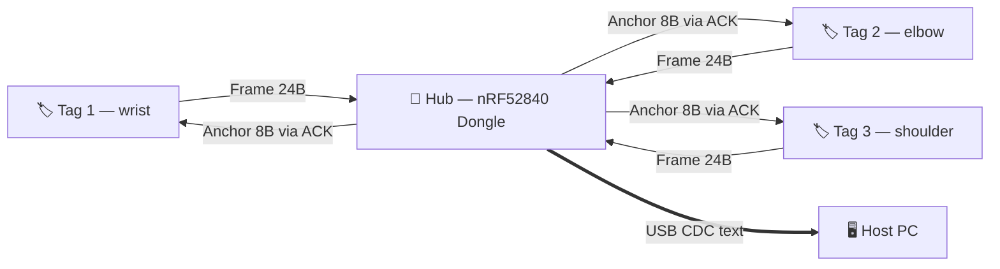
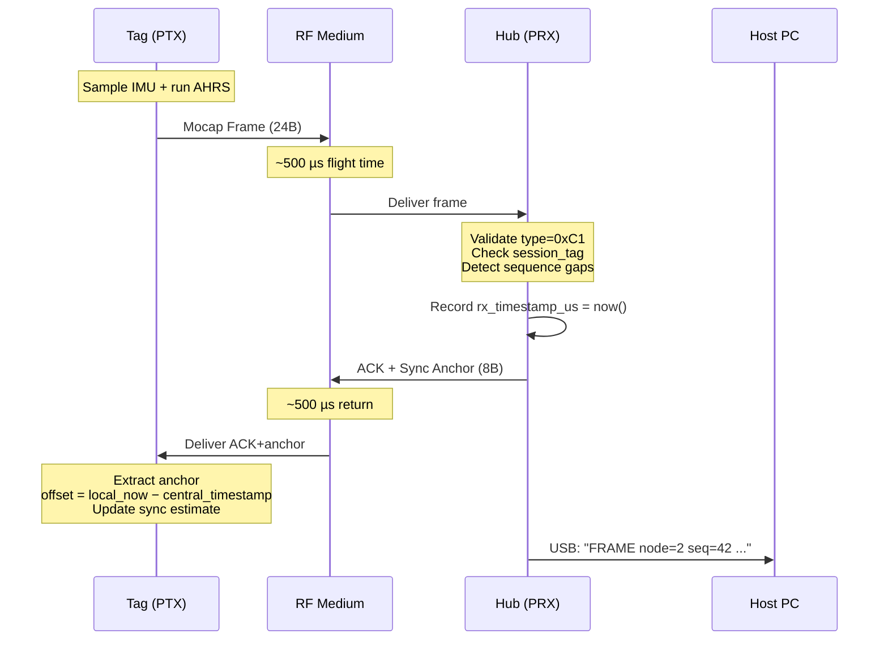
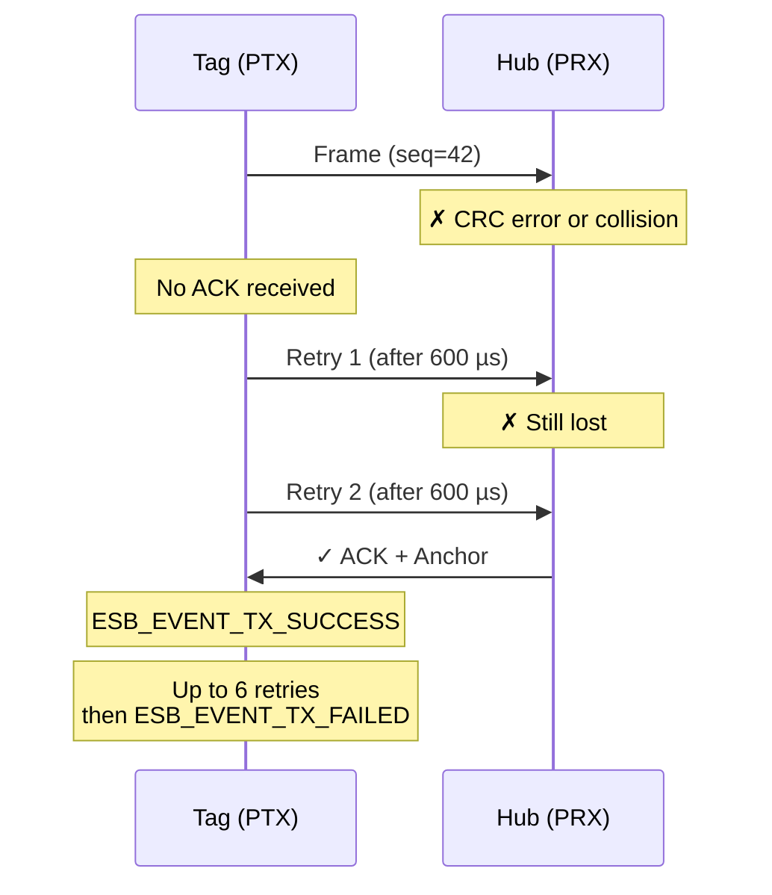
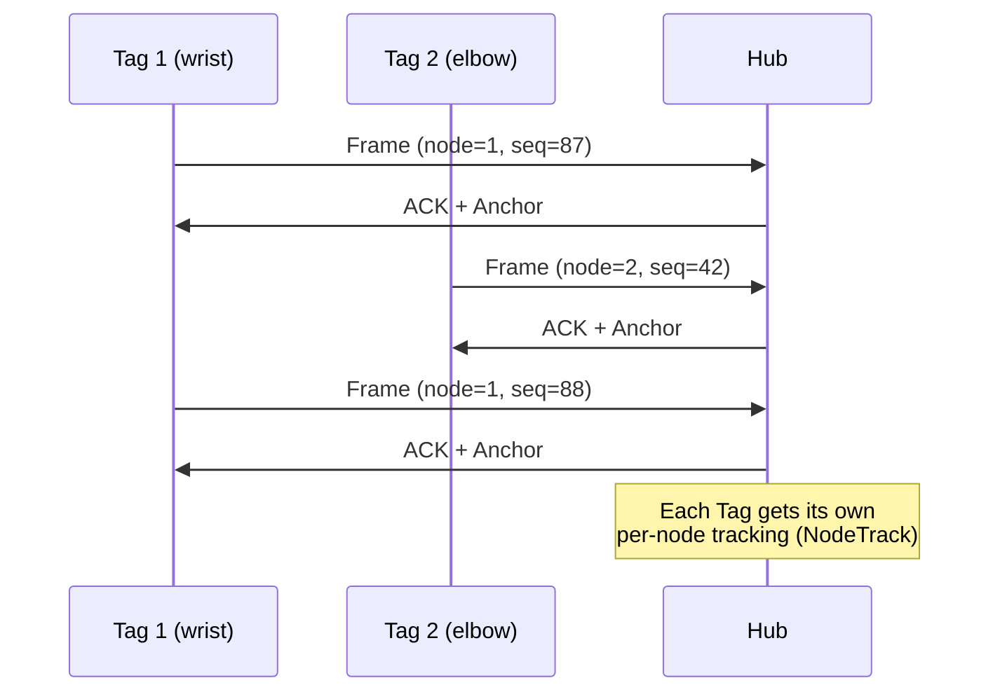
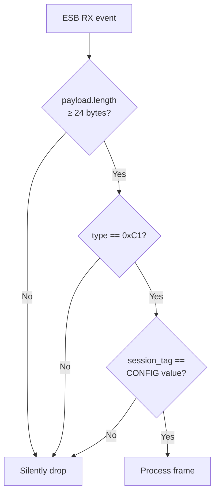
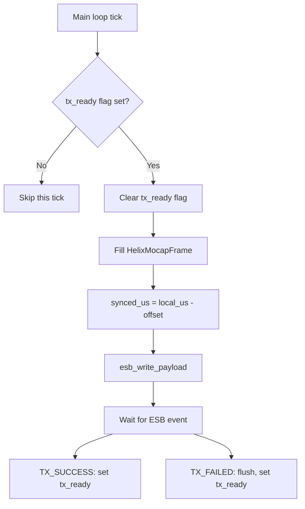
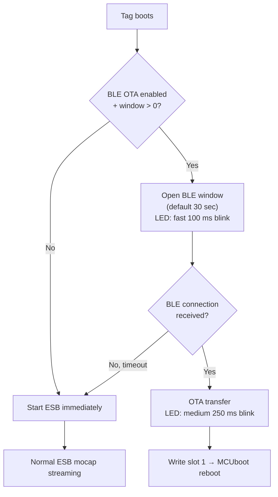

# RF Protocol Reference

> Definitive specification for the HelixDrift over-the-air protocol between
> Hub (central receiver) and Tag (body-worn sensor node).
>
> **Source of truth**: `zephyr_apps/nrf52840-mocap-bridge/src/main.cpp`

---

## 1. System Topology

HelixDrift uses a **star topology**: one Hub receives from multiple Tags.



**Roles:**

| Role | Hardware | ESB Mode | Responsibility |
|------|----------|----------|----------------|
| **Tag** | nRF52840 ProPico | PTX (transmitter) | Sample sensors, fuse orientation, transmit frames |
| **Hub** | nRF52840 Dongle | PRX (receiver) | Receive frames, send sync anchors, forward to PC over USB |

---

## 2. Physical Layer: ESB Configuration

The protocol runs on **Enhanced ShockBurst (ESB)** — Nordic's proprietary
2.4 GHz radio protocol. Not Bluetooth.

### 2.1 Why ESB Instead of BLE

| Property | BLE | ESB |
|----------|-----|-----|
| One-way latency | 15–20 ms (connection interval ≥ 7.5 ms) | **< 1 ms** |
| Retransmission | Application-layer | **Hardware-automatic** |
| Duty cycle | Higher (connection maintenance) | **< 5%** |
| Multi-node | Complex (1 connection per node) | **Simple star topology** |
| Throughput at 100 Hz × 8 nodes | Marginal | **Comfortable at 2 Mbps** |

Full comparison: `docs/rf-protocol-comparison.md`

### 2.2 Radio Parameters

| Parameter | Value | Notes |
|-----------|-------|-------|
| Protocol | ESB with Dynamic Payload Length (DPL) | Variable-size packets up to 32 bytes |
| Bit rate | **2 Mbps** | Minimizes time-on-air |
| RF channel | **40** (default) | Configurable 0–100; channel 40 = 2.440 GHz |
| Max payload | **32 bytes** | ESB hardware limit |
| Retransmit count | **6** | Up to 6 automatic retries on failed TX |
| Retransmit delay | **600 µs** | Delay between retry attempts |
| Auto-ACK | **Selective** | Hub ACKs only valid frames |
| CRC | **2-byte** (ESB hardware) | Automatic, not in application payload |

### 2.3 Pipe Addressing

ESB uses a 5-byte address per pipe. The Hub listens on pipe 0; Tags transmit
to pipe 0.

**Default Pipe 0 Address** (5 bytes, MSB first on air):

| Byte | 4 (prefix) | 3 | 2 | 1 | 0 |
|------|:----------:|:--:|:--:|:--:|:--:|
| **Value** | `0xE7` | `0xA1` | `0xB2` | `0xC1` | `0xD3` |
| **Role** | Pipe prefix | Base addr [3] | Base addr [2] | Base addr [1] | Base addr [0] |

**Room isolation**: In production, each Hub derives a unique base address
from its chip's FICR DEVICEADDR. Tags are pre-configured with their Hub's
address. Tags on Hub A cannot hear Hub B.

---

## 3. Packet Types

Two packet types exist on the air:

| Type ID | Name | Direction | Size | Delivery |
|---------|------|-----------|------|----------|
| `0xC1` | Mocap Frame | Tag → Hub | 24 bytes | Normal ESB TX |
| `0xA1` | Sync Anchor | Hub → Tag | 8 bytes | Piggybacked on ESB ACK |

### 3.1 Mocap Frame (`0xC1`) — Tag → Hub

Sent by the Tag at the configured cadence (default: every 20 ms = 50 Hz).

**Struct definition** (from `main.cpp`):

```c
struct __packed HelixMocapFrame {
    uint8_t  type;                      // 0xC1
    uint8_t  node_id;                   // Sender identity (1–255)
    uint8_t  sequence;                  // Frame counter (0–255, wraps)
    uint8_t  session_tag;               // Session filter (default: 77)
    uint32_t node_local_timestamp_us;   // Tag's raw clock at capture
    uint32_t node_synced_timestamp_us;  // Tag's clock mapped to Hub time
    int16_t  yaw_cdeg;                  // Yaw in centidegrees
    int16_t  pitch_cdeg;                // Pitch in centidegrees
    int16_t  roll_cdeg;                 // Roll in centidegrees
    int16_t  x_mm;                      // X position in millimeters
    int16_t  y_mm;                      // Y position in millimeters
    int16_t  z_mm;                      // Z position in millimeters
};
```

**Field-by-field layout** (little-endian, byte offset from start):

| Offset | Size | Field | Type | Range | Description |
|--------|------|-------|------|-------|-------------|
| 0 | 1 | `type` | `uint8_t` | `0xC1` | Packet type discriminator |
| 1 | 1 | `node_id` | `uint8_t` | 1–255 | Which body-part sensor sent this |
| 2 | 1 | `sequence` | `uint8_t` | 0–255 | Wrapping frame counter for gap detection |
| 3 | 1 | `session_tag` | `uint8_t` | 0–255 | Must match Hub's session; mismatches are silently dropped |
| 4 | 4 | `node_local_timestamp_us` | `uint32_t` | 0–4,294,967,295 | Microseconds on Tag's free-running clock when IMU was sampled |
| 8 | 4 | `node_synced_timestamp_us` | `uint32_t` | 0–4,294,967,295 | `node_local_timestamp_us − estimated_offset_us` — mapped into Hub's time domain |
| 12 | 2 | `yaw_cdeg` | `int16_t` | ±32,767 | Yaw angle × 100 (divide by 100 for degrees) |
| 14 | 2 | `pitch_cdeg` | `int16_t` | ±32,767 | Pitch angle × 100 |
| 16 | 2 | `roll_cdeg` | `int16_t` | ±32,767 | Roll angle × 100 |
| 18 | 2 | `x_mm` | `int16_t` | ±32,767 | X position in millimeters |
| 20 | 2 | `y_mm` | `int16_t` | ±32,767 | Y position in millimeters |
| 22 | 2 | `z_mm` | `int16_t` | ±32,767 | Z position in millimeters |
| | **24** | | | | **Total payload size** |

**Design notes:**

- **Centidegrees** (`int16_t`): Avoids floating-point on the radio path.
  ±327.67° range with 0.01° precision — sufficient for body motion.
- **Dual timestamps**: The PC receives both raw and synced timestamps.
  This lets the host verify sync quality without trusting only one clock.
- **Sequence wrapping**: 8-bit counter wraps at 256. Hub detects gaps by
  comparing `(last_sequence + 1) mod 256` to the received sequence.

### 3.2 Sync Anchor (`0xA1`) — Hub → Tag

Sent by the Hub, piggybacked inside the ESB automatic acknowledgment.

**Struct definition** (from `main.cpp`):

```c
struct __packed HelixSyncAnchor {
    uint8_t  type;                  // 0xA1
    uint8_t  central_id;            // Hub identity
    uint8_t  anchor_sequence;       // Anchor counter (gap detection)
    uint8_t  session_tag;           // Must match Tag's session
    uint32_t central_timestamp_us;  // Hub's clock at frame reception
};
```

**Field-by-field layout** (little-endian):

| Offset | Size | Field | Type | Range | Description |
|--------|------|-------|------|-------|-------------|
| 0 | 1 | `type` | `uint8_t` | `0xA1` | Packet type discriminator |
| 1 | 1 | `central_id` | `uint8_t` | 0–255 | Which Hub sent this (for multi-Hub setups) |
| 2 | 1 | `anchor_sequence` | `uint8_t` | 0–255 | Wrapping counter; Tag can detect missed anchors |
| 3 | 1 | `session_tag` | `uint8_t` | 0–255 | Must match Tag's session; mismatches are dropped |
| 4 | 4 | `central_timestamp_us` | `uint32_t` | 0–4,294,967,295 | Hub's clock reading (µs) at the moment the Tag's frame was received |
| | **8** | | | | **Total payload size** |

**How piggybacking works:**

ESB has a built-in "ACK with payload" feature. When the Hub receives a
valid frame, it loads the anchor struct into the ACK payload buffer
via `esb_write_payload()`. The next time ESB acknowledges a frame from
that Tag, the anchor data rides along — no extra radio transmission needed.

---

## 4. Protocol Exchange Sequence

### 4.1 Normal Frame Exchange



### 4.2 TX Failure and Retry



### 4.3 Multi-Node Interleaving

Tags transmit independently — no time slots, no coordination between Tags.
The Hub processes frames as they arrive.



---

## 5. Hub-Side Processing

### 5.1 Frame Validation

When the Hub receives a frame, it applies three checks before processing:



### 5.2 Per-Node Tracking

The Hub maintains a `NodeTrack` entry for each Tag it has seen (up to
`CONFIG_HELIX_MOCAP_MAX_TRACKED_NODES`, default 10):

```c
struct NodeTrack {
    uint8_t  node_id;
    bool     active;
    uint32_t packets;                 // Total frames received
    uint32_t gaps;                    // Total sequence gaps detected
    uint8_t  last_sequence;           // Last sequence number seen
    uint32_t last_node_timestamp_us;  // Last node_local_timestamp_us
    uint32_t last_synced_timestamp_us;
    uint32_t last_rx_timestamp_us;    // Hub's clock at reception
};
```

**Gap detection** uses wrapping subtraction:

```c
uint8_t expected = (uint8_t)(track->last_sequence + 1U);
if (frame->sequence != expected) {
    gaps = (uint8_t)(frame->sequence - expected);  // wrapping arithmetic
}
```

### 5.3 Anchor Response

Immediately after processing a valid frame, the Hub constructs an anchor
and loads it into the ESB ACK buffer:

```c
struct HelixSyncAnchor anchor = {
    .type               = 0xA1,
    .central_id         = CONFIG_HELIX_MOCAP_CENTRAL_ID,
    .anchor_sequence    = next_anchor_sequence++,
    .session_tag        = CONFIG_HELIX_MOCAP_SESSION_TAG,
    .central_timestamp_us = rx_timestamp_us,  // Hub's clock NOW
};
esb_write_payload(&ack);  // Loaded into ACK buffer for next TX from this pipe
```

---

## 6. Tag-Side Processing

### 6.1 Frame Assembly

Each tick of the main loop (every `CONFIG_HELIX_MOCAP_SEND_PERIOD_MS`,
default 20 ms):



Frame assembly fills: `type=0xC1`, `node_id` from config,
`sequence = tx_attempts mod 256`, both timestamps, and orientation data.

**Key detail — backpressure**: The `tx_ready` atomic flag prevents the Tag
from queuing a new frame while the previous one is still being retransmitted.
If ESB exhausts all 6 retries, it fires `TX_FAILED`, flushes, and allows the
next frame.

### 6.2 Anchor Reception and Sync

When the Tag receives an ACK containing an anchor:

```c
// From node_handle_anchor():
estimated_offset_us = (int32_t)(local_us - anchor->central_timestamp_us);
```

This single line is the entire sync algorithm on the Tag side. From this
point forward, every outgoing frame applies:

```c
synced_us = local_us - estimated_offset_us;
```

See [Time Synchronization Deep Dive](RF_TIME_SYNC_REFERENCE.md) for the
math, drift model, and convergence analysis.

### 6.3 LED Debug States

When `CONFIG_HELIX_MOCAP_NODE_LED_DEBUG` is enabled, the Tag's LED
communicates runtime state:

| LED Pattern | Period | Meaning |
|-------------|--------|---------|
| **Fast blink** | 125 ms | App alive, no confirmed TX success yet |
| **Medium blink** | 250 ms | TX succeeding, but no sync anchors received |
| **Slow blink** | 500 ms | Sync anchors received — Tag is synchronized ✓ |

---

## 7. USB Host Output Format

The Hub emits two types of text lines over USB CDC serial.

### 7.1 FRAME Lines

One per received mocap frame:

```
FRAME node=2 seq=42 node_us=1000000 sync_us=999500 rx_us=1000232 yaw_cd=900 pitch_cd=300 roll_cd=-10 x_mm=0 y_mm=1000 z_mm=2000 gaps=0
```

| Field | Type | Description |
|-------|------|-------------|
| `node` | uint | Tag node_id |
| `seq` | uint | Frame sequence number |
| `node_us` | uint | Tag's raw local timestamp (µs) |
| `sync_us` | uint | Tag's synced timestamp (µs, Hub's time domain) |
| `rx_us` | uint | Hub's clock at reception (µs) |
| `yaw_cd` | int | Yaw in centidegrees |
| `pitch_cd` | int | Pitch in centidegrees |
| `roll_cd` | int | Roll in centidegrees |
| `x_mm` | int | X position (mm) |
| `y_mm` | int | Y position (mm) |
| `z_mm` | int | Z position (mm) |
| `gaps` | uint | Sequence gaps detected since last frame from this node |

### 7.2 SUMMARY Lines

Emitted every 25 heartbeat ticks:

**Central (Hub):**
```
SUMMARY role=central rx=1543 anchors=1543 tracked=2 usb_lines=1543 err=0 hb=200
```

**Node (Tag):**
```
SUMMARY role=node id=1 tx_ok=500 tx_fail=3 anchors=497 offset_us=12345 err=0 hb=200
```

---

## 8. Configuration Reference

All values are set via Zephyr Kconfig. Role-specific overrides go in
`node.conf` (Tag) or `central.conf` (Hub).

| Config Key | Default | Range | Description |
|------------|---------|-------|-------------|
| `CONFIG_HELIX_MOCAP_BRIDGE_ROLE_CENTRAL` | `y` | bool | Enable Hub (PRX) role |
| `CONFIG_HELIX_MOCAP_BRIDGE_ROLE_NODE` | `n` | bool | Enable Tag (PTX) role |
| `CONFIG_HELIX_MOCAP_NODE_ID` | `1` | 1–255 | Tag's unique identity |
| `CONFIG_HELIX_MOCAP_CENTRAL_ID` | `0` | 0–255 | Hub's identity |
| `CONFIG_HELIX_MOCAP_PIPE` | `0` | 0–7 | ESB pipe for Tag TX |
| `CONFIG_HELIX_MOCAP_RF_CHANNEL` | `40` | 0–100 | RF channel (2.400 + N GHz) |
| `CONFIG_HELIX_MOCAP_SEND_PERIOD_MS` | `20` | 5–5000 | Tag TX interval (20 ms = 50 Hz, 10 ms = 100 Hz) |
| `CONFIG_HELIX_MOCAP_SESSION_TAG` | `77` | 0–255 | Session filter (must match between Hub and Tags) |
| `CONFIG_HELIX_MOCAP_MAX_TRACKED_NODES` | `10` | 1–16 | Max simultaneous Tags at Hub |
| `CONFIG_HELIX_MOCAP_USB_WAIT_FOR_DTR_MS` | `5000` | 0–30000 | Wait for USB host before starting |
| `CONFIG_HELIX_MOCAP_NODE_LED_DEBUG` | `y` | bool | Enable LED state encoding on Tag |

---

## 9. OTA Boot Window (Tag Only)

When BLE is enabled, the Tag opens a BLE advertising window at boot
before starting ESB:



**BLE OTA GATT UUIDs:**

| Characteristic | UUID |
|----------------|------|
| OTA Service | `3ef6a001-2d3b-4f2a-89e4-7b59d1c0a001` |
| OTA Control | `3ef6a002-2d3b-4f2a-89e4-7b59d1c0a001` |
| OTA Data | `3ef6a003-2d3b-4f2a-89e4-7b59d1c0a001` |
| OTA Status | `3ef6a004-2d3b-4f2a-89e4-7b59d1c0a001` |

---

## 10. Simulator Protocol Variant

The host-side simulator (`simulators/rf/RFSyncProtocol.hpp`) uses a slightly
different encoding optimized for 64-bit timestamps and full quaternion data:

| Type | Tag | Payload Fields | Size |
|------|-----|----------------|------|
| `ANCHOR` (1) | Simulator only | `sequence(u32)`, `masterTimestampUs(u64)` | 13 bytes |
| `FRAME` (2) | Simulator only | `sequence(u32)`, `localTimestampUs(u64)`, `estimatedOffsetUs(i64)`, `orientation(Quaternion)` | 37 bytes |

The simulator variant uses 64-bit timestamps (no 32-bit wrap concern in tests)
and transmits full quaternions instead of Euler angles. The on-hardware
protocol (sections 3.1–3.2) is the production format.

---

## Related Documents

- [Time Synchronization Deep Dive](RF_TIME_SYNC_REFERENCE.md) — offset
  estimation, drift model, convergence analysis
- [RF Protocol Comparison](rf-protocol-comparison.md) — ESB vs BLE vs
  802.15.4 tradeoff analysis
- [RF/Sync Requirements](rf-sync-requirements.md) — latency budget
  derivation
- [RF/Sync Architecture](rf-sync-architecture.md) — system-level sync
  design
- [M8 Mocap Bridge Workflow](M8_MOCAP_BRIDGE_WORKFLOW.md) — build, flash,
  and run instructions
