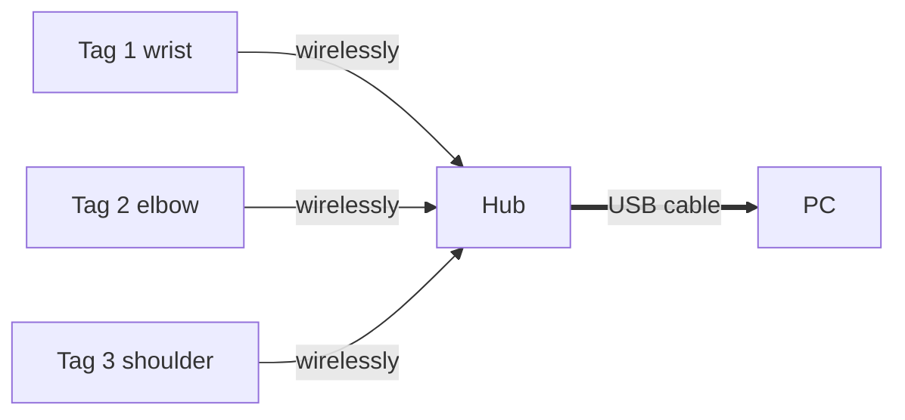
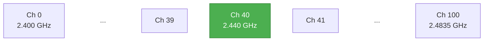
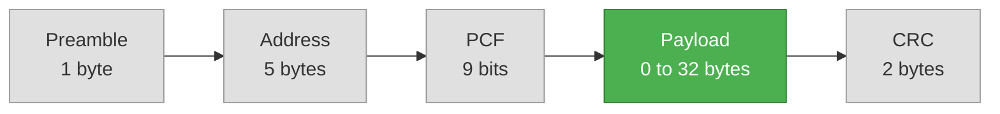
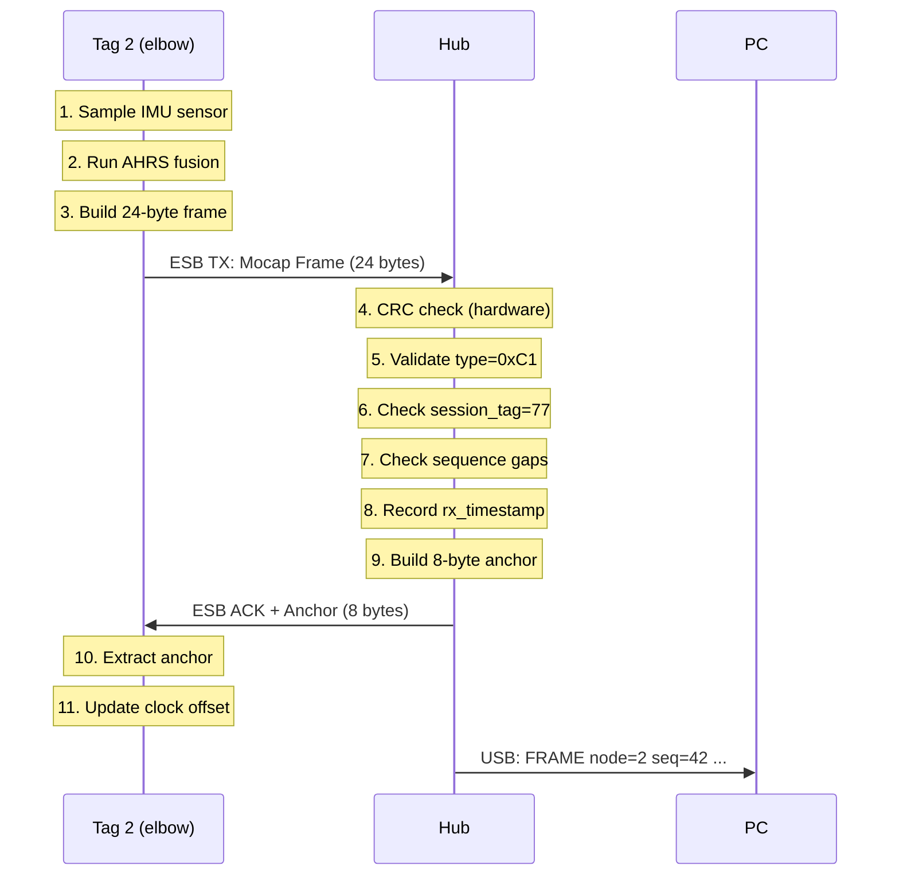
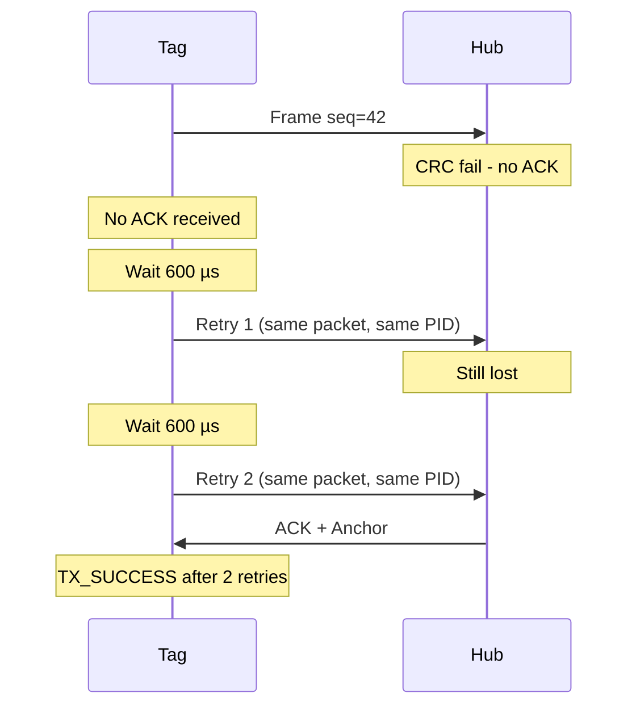
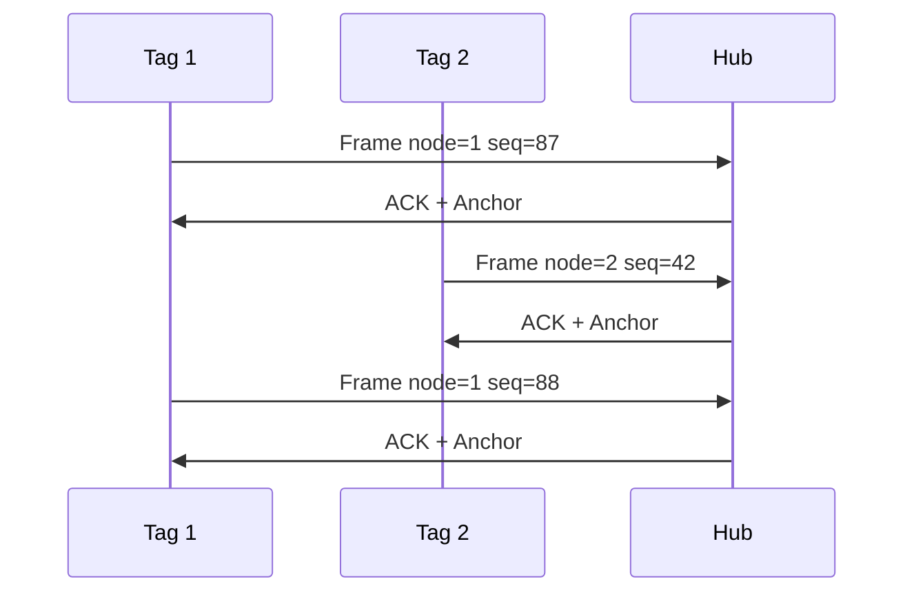
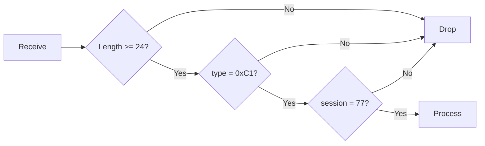
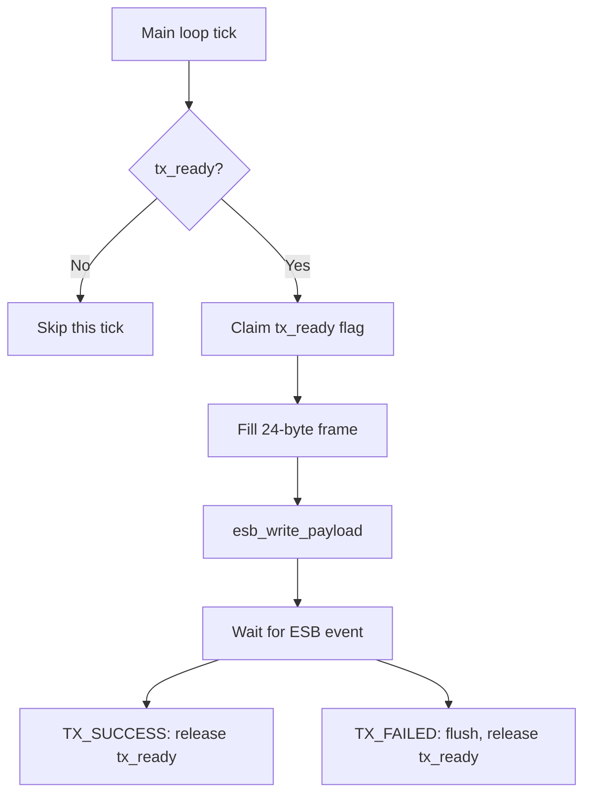
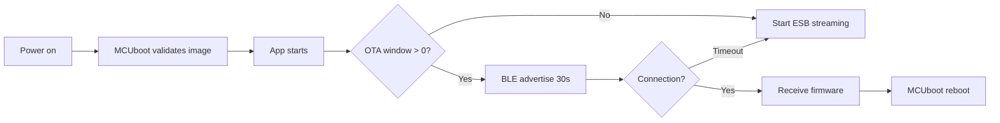

# HelixDrift RF Protocol Specification

> A complete, ground-up guide to the HelixDrift wireless protocol.
> Written for readers with no prior RF or embedded radio experience.
> Each chapter builds on the last — read them in order.
>
> **Firmware source of truth:**
> `zephyr_apps/nrf52840-mocap-bridge/src/main.cpp`

---

## Table of Contents

1. [What We Are Building](#1-what-we-are-building)
2. [Radio Fundamentals](#2-radio-fundamentals)
3. [Enhanced ShockBurst (ESB)](#3-enhanced-shockburst-esb)
4. [The ESB Packet on the Wire](#4-the-esb-packet-on-the-wire)
5. [HelixDrift Application Payloads](#5-helixdrift-application-payloads)
6. [Worked Example: Bytes on the Air](#6-worked-example-bytes-on-the-air)
7. [The Protocol Exchange](#7-the-protocol-exchange)
8. [Why Clocks Drift and How We Fix It](#8-why-clocks-drift-and-how-we-fix-it)
9. [Hub-Side Processing](#9-hub-side-processing)
10. [Tag-Side Processing](#10-tag-side-processing)
11. [USB Host Output Format](#11-usb-host-output-format)
12. [Configuration Reference](#12-configuration-reference)
13. [OTA Firmware Updates](#13-ota-firmware-updates)
14. [Simulator Protocol Variant](#14-simulator-protocol-variant)
15. [Related Documents](#15-related-documents)

---

## 1. What We Are Building

HelixDrift is a motion capture system. Small sensor nodes — called
**Tags** — are strapped to a performer's body (wrist, elbow, shoulder,
etc.). Each Tag measures orientation (yaw, pitch, roll) using an inertial
measurement unit (IMU). The Tags send that data wirelessly to a **Hub**
plugged into a PC.

The PC receives a stream of body orientation data from all Tags,
synchronized in time, and uses it to reconstruct the performer's motion.

**The system has exactly two types of device:**

| Device | Nickname | Hardware | Role |
|--------|----------|----------|------|
| **Tag** | "node" | nRF52840 ProPico | Reads sensors, computes orientation, transmits wirelessly |
| **Hub** | "central" | nRF52840 Dongle | Receives from all Tags, forwards to PC over USB cable |

**The topology is a star:** one Hub in the center, many Tags around it.
Tags never talk to each other. Everything goes through the Hub.



**Two things flow through the air:**

1. **Mocap Frames** (Tag → Hub): Orientation data, 50–100 times per second
2. **Sync Anchors** (Hub → Tag): Clock references so Tags stay in sync

We will explain what each of these is, byte by byte, in later chapters.
First, we need to understand the radio.

---

## 2. Radio Fundamentals

If you have never worked with wireless protocols, this chapter gives
you the minimum background to understand the rest of the document.

### 2.1 What Is 2.4 GHz?

The nRF52840 chip has a built-in radio that operates in the **2.4 GHz
ISM band** (2.400 – 2.4835 GHz). This is the same frequency range used
by Wi-Fi, Bluetooth, and your microwave oven. It is license-free
worldwide, meaning anyone can transmit on it without government approval
(within power limits).

The radio divides this band into **101 channels**, numbered 0–100. Each
channel is 1 MHz wide. Our system uses **channel 40** by default, which
corresponds to a center frequency of **2.440 GHz**.



> **We transmit on Channel 40 (2.440 GHz) by default.**

### 2.2 What Is a Packet?

Wireless communication works by sending **packets** — discrete chunks
of data. A packet is a sequence of bytes transmitted back-to-back over
the air. Think of it like a letter in an envelope:

- The **envelope** has the recipient's address, a return address, and
  some delivery metadata
- The **letter inside** is the actual data you want to send

In radio terms:

- The **header** contains addressing, length, and control fields
- The **payload** contains your application data (orientation, timestamps)
- A **CRC** at the end lets the receiver verify nothing was corrupted

### 2.3 What Is a Preamble?

Before the actual packet data, the transmitter sends a short, known
bit pattern called the **preamble**. The receiver uses this to:

1. **Detect** that a transmission is starting (vs. background noise)
2. **Lock** its clock to the transmitter's clock (bit synchronization)
3. **Set** its automatic gain control (AGC) to the right signal level

The preamble is always **1 byte** (8 bits) for the nRF52840. Its value
depends on the first bit of the address that follows:

| First address bit | Preamble byte | Preamble bits |
|:-:|:-:|:-:|
| 0 | `0x55` | `01010101` |
| 1 | `0xAA` | `10101010` |

The alternating 0-1 pattern gives the receiver the best signal to lock
onto. **You never see the preamble in software** — the radio hardware
generates it on transmit and strips it on receive. But it's physically
there on the air.

### 2.4 What Is a CRC?

A **Cyclic Redundancy Check** is a mathematical checksum appended to
the end of every packet. The transmitter computes it over the address +
control + payload bytes. The receiver recomputes it and compares. If they
don't match, the packet was corrupted in flight (by interference, noise,
or collision) and is **silently discarded**.

Our system uses a **2-byte CRC** (CRC-16), which catches ~99.998% of
random bit errors.

Like the preamble, **CRC is handled entirely in hardware**. Your firmware
never computes or checks it — the radio does it automatically.

---

## 3. Enhanced ShockBurst (ESB)

Now that you understand basic radio concepts, let's talk about the
specific protocol HelixDrift uses.

### 3.1 What Is ESB?

**Enhanced ShockBurst** is Nordic Semiconductor's proprietary radio
protocol for their nRF chips. It sits between "raw radio" (where you
manage everything yourself) and a full protocol stack like Bluetooth LE.

Think of it as a **lightweight packet radio with built-in reliability**:
the hardware handles packet framing, addressing, CRC checking,
acknowledgments, and retransmissions — but there's no connection setup,
no pairing, no service discovery. You just fire packets.

### 3.2 Why Not Bluetooth LE?

This is the single most important design decision in the system. Here's
why ESB wins for motion capture:

| Property | Bluetooth LE | ESB |
|---|---|---|
| **Latency** | 15–20 ms minimum (connection interval ≥ 7.5 ms) | **< 1 ms** one-way |
| **Retransmission** | You write the retry logic yourself | **Hardware-automatic** (up to 6 retries) |
| **Multi-node** | 1 BLE connection per node; complex state machine | **Simple star**, fire-and-forget |
| **Power** | Higher (connection maintenance overhead) | **< 5% duty cycle** |
| **Throughput at 100 Hz × 8 nodes** | Marginal (saturates connection intervals) | **Comfortable at 2 Mbps** |
| **Code size** | ~60 KB for BLE softdevice | **< 5 KB** for ESB |

For mocap, **latency is everything**. BLE's 15 ms minimum means body
motion arrives at the PC 15 ms late — that's visible, unacceptable lag.
ESB gets frames through in under 1 millisecond.

> **BLE is still used** — but *only* for over-the-air firmware updates
> (OTA). During normal mocap streaming, the radio runs ESB exclusively.
> The two never run at the same time.

Full comparison: [rf-protocol-comparison.md](rf-protocol-comparison.md)

### 3.3 ESB Modes: PTX and PRX

ESB has two roles, and each device picks one at initialization:

| Mode | Full Name | Role | Our Device |
|------|-----------|------|------------|
| **PTX** | Primary Transmitter | Sends packets, listens for ACKs | **Tag** |
| **PRX** | Primary Receiver | Listens for packets, sends ACKs | **Hub** |

This is a **fixed star topology**: one PRX (Hub) at the center, up to
many PTX devices (Tags) around it. Tags can only talk to the Hub, not
to each other.

### 3.4 ESB Features We Use

| Feature | What It Does | Our Configuration |
|---------|-------------|-------------------|
| **Dynamic Payload Length (DPL)** | Payload size varies per packet (0–32 bytes) | Enabled (`ESB_PROTOCOL_ESB_DPL`) |
| **Auto-ACK** | PRX automatically acknowledges valid packets | Enabled (selective) |
| **ACK with Payload** | PRX can stuff data into the ACK packet | We stuff sync anchors into ACKs |
| **Auto-Retransmit** | PTX retries failed transmissions automatically | 6 retries, 600 µs delay |
| **2 Mbps bit rate** | Fastest available; minimizes time-on-air | Enabled |
| **Multi-pipe** | PRX can listen on up to 8 addresses (pipes) simultaneously | We use pipe 0 only |

---

## 4. The ESB Packet on the Wire

This is the most important chapter. It describes the **exact sequence
of bits** that physically travel through the air when a Tag sends a
frame to the Hub.

### 4.1 Complete Packet Structure

Every ESB packet has this structure, MSB (most significant bit) first
on the air:



> **Green = your application data.** Grey = handled entirely by radio hardware.
> You only ever touch the Payload. Everything else is automatic.

**Total bytes on air** for a 24-byte mocap frame:
1 (preamble) + 5 (address) + 2 (PCF, rounded to bytes) + 24 (payload)
+ 2 (CRC) = **34 bytes** on the air for 24 bytes of useful data.

### 4.2 Field-by-Field Breakdown

#### 4.2.1 Preamble (1 byte)

| Property | Value |
|----------|-------|
| Size | 1 byte (8 bits) |
| Content | `0x55` or `0xAA` (depends on first address bit) |
| Purpose | Receiver clock synchronization and signal detection |
| Generated by | Radio hardware (automatic) |
| Visible to firmware? | **No** |

The preamble is a fixed alternating bit pattern that the receiver uses
to detect the start of a packet and synchronize its sampling clock. You
never interact with it in code.

#### 4.2.2 Address (3–5 bytes)

The address identifies which "pipe" (logical channel) this packet is
for. In ESB, the PRX (Hub) can listen on up to 8 pipes simultaneously,
each with a different address. The PTX (Tag) targets a specific pipe.

We use **5-byte addresses** (the maximum):

| Property | Value |
|----------|-------|
| Size | 5 bytes (40 bits) |
| Structure | 4-byte base address + 1-byte pipe prefix |
| Pipe 0 (our pipe) | `E7 A1 B2 C1 D3` |
| Generated by | Radio hardware from configured base + prefix |
| Visible to firmware? | Only during configuration |

How the address is constructed (our actual initialization code):

```c
// From esb_initialize() in main.cpp:
uint8_t base_addr_0[4] = {0xD3, 0xC1, 0xB2, 0xA1};   // base address
uint8_t addr_prefix[8] = {0xE7, 0xC2, 0xC3, ...};     // per-pipe prefix

// Pipe 0 on-air address = prefix[0] + base_addr_0 = E7 A1 B2 C1 D3
```

On the air, the address bytes appear in this order:

```
Byte on air:    E7       A1       B2       C1       D3
               ┌────┐   ┌────┐   ┌────┐   ┌────┐   ┌────┐
               │0xE7│   │0xA1│   │0xB2│   │0xC1│   │0xD3│
               │pfx │   │base│   │base│   │base│   │base│
               │    │   │ [3]│   │ [2]│   │ [1]│   │ [0]│
               └────┘   └────┘   └────┘   └────┘   └────┘
```

The receiver compares these 5 bytes against its configured pipe
addresses. If none match, the packet is discarded before the firmware
ever sees it.

> **Room isolation:** In production, each Hub derives a unique base
> address from its chip's hardware ID (FICR DEVICEADDR). Tags are
> pre-configured with their Hub's address. This means Tags on Hub A
> literally cannot hear Hub B — they operate on different addresses,
> like different phone numbers.

#### 4.2.3 Packet Control Field — PCF (9 bits)

The PCF is a 9-bit field that carries packet metadata. In DPL mode
(Dynamic Payload Length), it has three sub-fields:

```
 Bit:  8     7  6  5  4  3  2  1  0
      ┌────┬──────────────────┬─────┐
      │NoAk│  Payload Length  │ PID │
      │1bit│     6 bits       │2bits│
      └────┴──────────────────┴─────┘
```

| Sub-field | Bits | Size | Purpose |
|-----------|:----:|:----:|---------|
| **PID** (Packet ID) | 0–1 | 2 bits | Unique ID for deduplication. If the PTX retransmits the same packet (because it didn't get an ACK), the PID stays the same so the PRX can detect and discard duplicates. |
| **Payload Length** | 2–7 | 6 bits | Number of payload bytes (0–32). In DPL mode, this tells the receiver how many bytes to extract. For our mocap frame, this is 24 (`011000`). For a sync anchor ACK, this is 8 (`001000`). |
| **No-ACK** | 8 | 1 bit | If set, the PRX should NOT acknowledge this packet. We set this to 0 (ACK requested) for all frames because we want reliable delivery + sync anchors back. |

**You never set PCF directly.** The ESB hardware populates it from:
- `tx_payload.length` → payload length field
- `tx_payload.noack` → no-ACK bit
- PID auto-increments per new packet, stays same on retransmit

#### 4.2.4 Payload (0–32 bytes)

This is the **only part your application code controls**. For HelixDrift,
the payload contains one of two structs:

| Packet type | Payload size | Direction | Contents |
|-------------|:------------:|-----------|----------|
| **Mocap Frame** | 24 bytes | Tag → Hub | Orientation + timestamps |
| **Sync Anchor** | 8 bytes | Hub → Tag (in ACK) | Hub's clock reference |

We describe these structs in detail in Chapter 5.

#### 4.2.5 CRC (2 bytes)

| Property | Value |
|----------|-------|
| Size | 2 bytes (16 bits) |
| Polynomial | CRC-16-CCITT |
| Computed over | Address + PCF + Payload |
| Generated by | Radio hardware (automatic) |
| Checked by | Radio hardware (automatic) |
| Visible to firmware? | **No** — failed CRC = packet silently discarded |

### 4.3 Putting It All Together: Complete Packet on the Air

Here's what a **24-byte mocap frame** looks like as it physically
travels from Tag to Hub:

```
On-air byte:  0     1     2     3     4     5     6    7    8     9  ...  32    33    34
            ┌─────┬─────┬─────┬─────┬─────┬─────┬─────────────┬────...────┬─────┬─────┐
            │0xAA │0xE7 │0xA1 │0xB2 │0xC1 │0xD3 │  PCF (9b)   │ Payload   │CRC-H│CRC-L│
            │pream│addr │addr │addr │addr │addr │len=24,noack │ 24 bytes  │     │     │
            │ble  │pfx  │base3│base2│base1│base0│=0, pid=auto │ (Ch.5)    │     │     │
            └─────┴─────┴─────┴─────┴─────┴─────┴─────────────┴────...────┴─────┴─────┘
             ▲                                                  ▲
             │                                                  │
             Radio hardware                                Your firmware
             handles this                                  provides this
```

At **2 Mbps**, these 34 bytes take approximately **136 µs** to transmit
(34 × 8 bits ÷ 2,000,000 bits/sec = 136 µs). That's 0.136 milliseconds.

### 4.4 The ACK Packet

When the Hub (PRX) receives a valid packet, it automatically sends back
an **ACK** (acknowledgment). The ACK is itself a full ESB packet with
the same address, but with the Hub's payload stuffed inside:

```
ACK on air:   0     1     2     3     4     5     6    7    8  ...  14    15    16
            ┌─────┬─────┬─────┬─────┬─────┬─────┬─────────────┬──...──┬─────┬─────┐
            │0xAA │0xE7 │0xA1 │0xB2 │0xC1 │0xD3 │  PCF (9b)   │Anchor │CRC-H│CRC-L│
            │pream│addr │addr │addr │addr │addr │len=8, noack │8 bytes│     │     │
            │ble  │pfx  │base3│base2│base1│base0│=0, pid=auto │(Ch.5) │     │     │
            └─────┴─────┴─────┴─────┴─────┴─────┴─────────────┴──...──┴─────┴─────┘
```

This is the clever trick: **the sync anchor rides for free inside the
hardware ACK**. No extra radio transmission is needed — the ACK was
going to be sent anyway. ESB's "ACK with payload" feature lets the Hub
stuff 8 bytes of clock data into an acknowledgment it would have sent
regardless.

---

## 5. HelixDrift Application Payloads

Now we zoom into the payload — the 24 or 8 bytes that ride inside the
ESB packet. This is the application-level protocol that HelixDrift defines.

**Only two packet types exist:**

| Type ID byte | Name | Direction | Payload size | Sent how |
|:------------:|------|-----------|:------------:|----------|
| `0xC1` | **Mocap Frame** | Tag → Hub | 24 bytes | Normal ESB TX |
| `0xA1` | **Sync Anchor** | Hub → Tag | 8 bytes | Stuffed into ESB ACK |

### 5.1 Mocap Frame (`0xC1`) — Tag → Hub

This is the main data packet. Every 20 ms (at 50 Hz default), each Tag
builds one and transmits it.

#### The C struct (from `main.cpp`, line 51):

```c
struct __packed HelixMocapFrame {
    uint8_t  type;                      // Always 0xC1
    uint8_t  node_id;                   // Which Tag sent this (1–255)
    uint8_t  sequence;                  // Frame counter (wraps 0–255)
    uint8_t  session_tag;               // Session filter (default: 77)
    uint32_t node_local_timestamp_us;   // Tag's own clock (microseconds)
    uint32_t node_synced_timestamp_us;  // Tag's clock adjusted to Hub time
    int16_t  yaw_cdeg;                  // Yaw in centidegrees (÷100 = degrees)
    int16_t  pitch_cdeg;                // Pitch in centidegrees
    int16_t  roll_cdeg;                 // Roll in centidegrees
    int16_t  x_mm;                      // X position in millimeters
    int16_t  y_mm;                      // Y position in millimeters
    int16_t  z_mm;                      // Z position in millimeters
};
```

The `__packed` attribute tells the compiler: no padding between fields.
The struct is exactly 24 bytes, laid out contiguously in memory, and
`memcpy`'d directly into the ESB TX buffer.

#### Byte-by-byte memory layout

All multi-byte fields are **little-endian** (least significant byte
first). This is the native byte order of the ARM Cortex-M4 CPU inside
the nRF52840 — the struct bytes in memory are the exact same bytes that
go over the air.

```
Offset  Bytes    Field                      Type      Example value
──────  ───────  ─────────────────────────  ────────  ─────────────────
  0     [  C1 ]  type                       uint8     0xC1 (mocap frame)
  1     [  02 ]  node_id                    uint8     2 (elbow)
  2     [  2A ]  sequence                   uint8     42
  3     [  4D ]  session_tag                uint8     77 (0x4D)
  4     [  40 42 0F 00 ]  node_local_timestamp_us   uint32    1,000,000 µs
  8     [  8C 3F 0F 00 ]  node_synced_timestamp_us  uint32    999,500 µs
 12     [  41 23 ]  yaw_cdeg               int16     9025 → 90.25°
 14     [  B8 0B ]  pitch_cdeg             int16     3000 → 30.00°
 16     [  F6 FF ]  roll_cdeg              int16     -10 → -0.10°
 18     [  00 00 ]  x_mm                   int16     0 mm
 20     [  E8 03 ]  y_mm                   int16     1000 mm
 22     [  D0 07 ]  z_mm                   int16     2000 mm
──────  ───────  ─────────────────────────  ────────  ─────────────────
        24 bytes total
```

#### Field reference

| Field | Offset | Size | Type | Range | What it means |
|-------|:------:|:----:|------|-------|---------------|
| `type` | 0 | 1 | u8 | Always `0xC1` | Packet type discriminator. The first thing the receiver checks. |
| `node_id` | 1 | 1 | u8 | 1–255 | Which body part sent this. Each Tag has a unique ID configured at build time. E.g., 1 = wrist, 2 = elbow, 3 = shoulder. |
| `sequence` | 2 | 1 | u8 | 0–255 | Wrapping frame counter. Goes 0, 1, 2, ..., 255, 0, 1, ... The Hub uses this to detect dropped frames: if it sees seq=42 then seq=45, it knows frames 43 and 44 were lost. |
| `session_tag` | 3 | 1 | u8 | 0–255 | Session filter. Must match the Hub's configured value (default 77). If a Tag from a different session/room is heard, its frames are silently dropped. |
| `node_local_timestamp_us` | 4 | 4 | u32 | 0 – 4,294,967,295 | The Tag's free-running clock in microseconds at the moment the IMU was sampled. This clock has no relationship to the Hub's clock — it's the Tag's own time. Wraps after ~71.6 minutes. |
| `node_synced_timestamp_us` | 8 | 4 | u32 | 0 – 4,294,967,295 | The same timestamp, adjusted to the Hub's time domain using the sync offset: `local_us - estimated_offset_us`. Before the first sync anchor is received, this equals `local_us`. |
| `yaw_cdeg` | 12 | 2 | i16 | ±32,767 | Yaw angle in **centidegrees** (hundredths of a degree). Divide by 100 to get degrees. Range: ±327.67° with 0.01° precision. |
| `pitch_cdeg` | 14 | 2 | i16 | ±32,767 | Pitch angle in centidegrees. |
| `roll_cdeg` | 16 | 2 | i16 | ±32,767 | Roll angle in centidegrees. |
| `x_mm` | 18 | 2 | i16 | ±32,767 | X position in millimeters. Range: ±32.7 meters. |
| `y_mm` | 20 | 2 | i16 | ±32,767 | Y position in millimeters. |
| `z_mm` | 22 | 2 | i16 | ±32,767 | Z position in millimeters. |

#### Design decisions explained

**Why centidegrees instead of floats?** A 32-bit IEEE 754 float is
4 bytes. A centidegree `int16_t` is 2 bytes — half the size. With
6 motion fields (3 angles + 3 positions), that saves 12 bytes per
packet. More importantly, integer math is deterministic and avoids
floating-point edge cases in the radio path. The ±327.67° range with
0.01° precision is more than sufficient for human body motion.

**Why two timestamps?** The PC receives both the raw local clock
(`node_us`) and the synced estimate (`sync_us`). This lets the host
software verify sync quality independently: if `sync_us` closely tracks
the Hub's own `rx_us` timestamp, sync is working. If they diverge,
something is wrong.

**Why a session tag?** In a studio with multiple Hubs (different rooms
or different performers), a Tag might accidentally be within radio range
of the wrong Hub. The session tag acts as a cheap filter — if it doesn't
match, the frame is dropped before any processing. This is a second
layer of isolation on top of the pipe address.

### 5.2 Sync Anchor (`0xA1`) — Hub → Tag

The sync anchor is the Hub's way of saying: "I received your frame,
and my clock read THIS value at that moment." The Tag uses this to
synchronize its clock to the Hub (explained in Chapter 8).

#### The C struct (from `main.cpp`, line 43):

```c
struct __packed HelixSyncAnchor {
    uint8_t  type;                  // Always 0xA1
    uint8_t  central_id;            // Hub identity (for multi-Hub)
    uint8_t  anchor_sequence;       // Counter for missed anchor detection
    uint8_t  session_tag;           // Must match Tag's session
    uint32_t central_timestamp_us;  // Hub's clock when it received the frame
};
```

#### Byte-by-byte memory layout

```
Offset  Bytes    Field                    Type      Example value
──────  ───────  ───────────────────────  ────────  ────────────────────
  0     [  A1 ]  type                     uint8     0xA1 (sync anchor)
  1     [  00 ]  central_id               uint8     0 (Hub 0)
  2     [  0F ]  anchor_sequence          uint8     15
  3     [  4D ]  session_tag              uint8     77 (0x4D)
  4     [  48 43 0F 00 ]  central_timestamp_us  uint32  1,000,232 µs
──────  ───────  ───────────────────────  ────────  ────────────────────
        8 bytes total
```

#### Field reference

| Field | Offset | Size | Type | Range | What it means |
|-------|:------:|:----:|------|-------|---------------|
| `type` | 0 | 1 | u8 | Always `0xA1` | Packet type discriminator. |
| `central_id` | 1 | 1 | u8 | 0–255 | Which Hub sent this. In a multi-Hub studio, Tags can verify they're hearing their own Hub. |
| `anchor_sequence` | 2 | 1 | u8 | 0–255 | Wrapping counter. The Tag can detect missed anchors by checking for gaps, just like the Hub does with frame sequences. |
| `session_tag` | 3 | 1 | u8 | 0–255 | Session filter. Must match the Tag's configured value. |
| `central_timestamp_us` | 4 | 4 | u32 | 0 – 4,294,967,295 | The Hub's clock reading in microseconds at the exact moment the Hub received the Tag's frame. This is the reference the Tag uses to compute its clock offset. |

#### How piggybacking works

ESB has a feature called **"ACK with payload."** Here's the sequence:

1. Hub (PRX) receives a valid frame from a Tag
2. Hub firmware builds an 8-byte `HelixSyncAnchor` struct
3. Hub calls `esb_write_payload()` to load the anchor into the ACK buffer
4. The *next* time the Tag sends a frame on that pipe, ESB automatically
   includes the anchor bytes in the hardware acknowledgment

The anchor doesn't cause a separate radio transmission — it hitchhikes
on the ACK that ESB would have sent anyway. This is why we call it
**"free-riding"**: zero additional radio time, zero additional power.

---

## 6. Worked Example: Bytes on the Air

Let's trace a complete transmission. **Tag 2** (elbow) sends its 42nd
frame. The IMU measured yaw = 90.25°, pitch = 30.00°, roll = −0.10°.
The Tag's local clock reads 1,000,000 µs. Its sync offset is 500 µs,
so the synced time is 999,500 µs. Position is (0, 1000, 2000) mm.

### 6.1 The Application Payload (24 bytes)

First, the firmware fills the struct. Here's what's in memory:

```
Byte: 00   01   02   03   04   05   06   07   08   09   0A   0B
Hex:  C1   02   2A   4D   40   42   0F   00   8C   3F   0F   00
      ╰─╯  ╰─╯  ╰─╯  ╰─╯  ╰──────────────╯  ╰──────────────╯
      type id   seq  sess  local_ts=1000000   synced_ts=999500

Byte: 0C   0D   0E   0F   10   11   12   13   14   15   16   17
Hex:  41   23   B8   0B   F6   FF   00   00   E8   03   D0   07
      ╰────────╯  ╰────────╯  ╰────────╯  ╰────────╯  ╰────────╯  ╰────────╯
      yaw=9025    pitch=3000  roll=-10     x=0         y=1000     z=2000
```

Let's verify one field — `node_local_timestamp_us = 1,000,000`:
- 1,000,000 in hex = `0x000F4240`
- Little-endian (low byte first) = `40 42 0F 00` ✓

And `yaw_cdeg = 9025` (which is 90.25°):
- 9025 in hex = `0x2341`
- Little-endian = `41 23` ✓

And `roll_cdeg = -10` (which is −0.10°):
- −10 as signed int16 = `0xFFF6`
- Little-endian = `F6 FF` ✓

### 6.2 The Complete Packet on the Air (34 bytes)

Now ESB wraps the payload in its packet structure:

```
Byte:  0     1     2     3     4     5     6-7       8  ...  31    32    33
     ┌─────┬─────┬─────┬─────┬─────┬─────┬─────────┬────────────┬─────┬─────┐
     │ AA  │ E7  │ A1  │ B2  │ C1  │ D3  │PCF: L=24│ [payload]  │CRC  │CRC  │
     │prmbl│ addr bytes (pipe 0)         │PID,NoAck│  24 bytes  │ hi  │ lo  │
     └─────┴─────┴─────┴─────┴─────┴─────┴─────────┴────────────┴─────┴─────┘
     │◄──── radio hardware ─────────────►│◄ firm- ►│◄── radio hardware ──►│
                                          ware
```

### 6.3 The ACK Coming Back (16 bytes on air)

The Hub receives the frame, validates it, builds an anchor with its
own clock reading (1,000,232 µs), and loads it into the ACK buffer:

```
ACK:   0     1     2     3     4     5     6-7       8  ...  15    16    17
     ┌─────┬─────┬─────┬─────┬─────┬─────┬─────────┬────────────┬─────┬─────┐
     │ AA  │ E7  │ A1  │ B2  │ C1  │ D3  │PCF: L=8 │ A1 00 0F   │CRC  │CRC  │
     │prmbl│ addr bytes (pipe 0)         │PID,NoAck│ 4D 48 43   │ hi  │ lo  │
     │     │                             │         │ 0F 00      │     │     │
     │     │                             │         │ (anchor)   │     │     │
     └─────┴─────┴─────┴─────┴─────┴─────┴─────────┴────────────┴─────┴─────┘
```

### 6.4 What the Tag Does with the Anchor

When the Tag receives the ACK, it extracts the anchor payload and runs
one calculation:

```c
// Tag's clock reads 1,001,000 µs at this moment
// Anchor says Hub's clock read 1,000,232 µs when it got the frame
estimated_offset_us = 1,001,000 - 1,000,232 = 768 µs

// From now on, every outgoing frame:
synced_us = local_us - 768
```

The Tag now knows its clock is ~768 µs ahead of the Hub. All future
frames use this offset to report timestamps in the Hub's time domain.

---

## 7. The Protocol Exchange

Now that you know what the packets look like, let's see how they flow
between devices.

### 7.1 Normal Frame Exchange (Happy Path)



**Total round-trip time**: ~300–500 µs (including radio flight time
and processing).

### 7.2 Retry on Failure

If the Hub doesn't receive the packet cleanly (CRC failure, collision
with another Tag, interference), it sends no ACK. The Tag's radio
hardware automatically retries:



The PID (Packet ID) in the PCF stays the same across retries. This
lets the Hub deduplicate — if the ACK was lost but the original frame
arrived, the Hub won't process the same frame twice.

After **6 failed retries** (configurable), the radio gives up and fires
a `TX_FAILED` event. The Tag flushes its TX buffer and moves on to the
next frame. The Hub will detect the gap via the sequence counter.

### 7.3 Multi-Node Interleaving

Tags transmit independently. There are no time slots and no coordination
between Tags. Each Tag has its own 20 ms timer and fires whenever it's
ready:



**What about collisions?** If two Tags transmit at the exact same
moment, both packets corrupt each other. Neither gets an ACK, and both
retry after their (different) random backoff delays. Because packets
are only ~136 µs long and the interval between packets is ~20,000 µs,
the probability of collision is very low — roughly 0.7% per frame
with 8 Tags at 100 Hz.

---

## 8. Why Clocks Drift and How We Fix It

This chapter explains the problem that sync anchors solve, and why
they are necessary.

### 8.1 The Problem: Crystal Oscillators Are Imperfect

Every nRF52840 chip has a quartz crystal oscillator that drives its
system clock. These crystals are very accurate — but not perfect.
Each crystal has two sources of error:

**Offset**: At power-on, each Tag's clock starts at a different value.
Tag 1 might boot 5 ms before Tag 2, so their clocks are already
5,000 µs apart from the very beginning.

**Drift**: Each crystal runs at a slightly different rate. A crystal
rated at ±20 ppm (parts per million) might run 20 millionths faster
or slower than the nominal frequency. That's tiny — but it accumulates:

| Time elapsed | Max drift at ±20 ppm | Effect |
|:------------:|:--------------------:|--------|
| 1 second | ±20 µs | Negligible |
| 10 seconds | ±200 µs | Starting to matter |
| 1 minute | ±1,200 µs (1.2 ms) | **Visible in mocap data** |
| 5 minutes | ±6,000 µs (6 ms) | Significant timing error |
| 1 hour | ±72,000 µs (72 ms) | **Useless for multi-node mocap** |

If Tags are out of sync, the PC cannot determine the temporal ordering
of sensor readings from different body parts. A wrist reading tagged
"now" by one Tag might actually be from 6 ms ago compared to the
elbow Tag's "now."

**Target**: Inter-node sync error < 1 ms (from
[rf-sync-requirements.md](rf-sync-requirements.md)).

### 8.2 The Solution: Continuous Clock Correction via Anchors

The sync anchor solves this by giving every Tag a common time reference:
the Hub's clock. Here's how:

1. Tag sends a frame. The Hub receives it and notes its own clock:
   `rx_timestamp = 1,000,232 µs`

2. Hub stuffs that timestamp into an anchor and sends it back in the ACK

3. Tag receives the anchor. At this moment, the Tag's clock reads
   `1,001,000 µs`

4. Tag calculates: `offset = my_clock - hub_clock = 1,001,000 - 1,000,232 = 768 µs`

5. From now on, Tag reports: `synced_time = my_clock - 768`

That single subtraction is the **entire sync algorithm**. One line of
code:

```c
estimated_offset_us = (int32_t)(local_us - anchor->central_timestamp_us);
```

### 8.3 Why It Works Despite Being So Simple

You might think: "But the offset includes radio propagation delay and
processing time. Isn't that an error?"

Yes — the offset is biased by roughly 300–500 µs of one-way delay.
But this bias is **constant and affects all Tags equally**. When the PC
compares `sync_us` values from two different Tags, the bias cancels out.
What matters is the *relative* timing between Tags, not the absolute
accuracy vs. the Hub.

### 8.4 Why Continuous? Won't One Anchor Suffice?

A single anchor gives a perfect offset *at that moment*. But crystal
drift means the offset changes over time. A 20 ppm crystal drifts
~20 µs per second. If you only synced once at boot, after 1 minute
the offset would be 1.2 ms wrong.

But anchors arrive on **every frame ACK** — 50 to 100 times per second.
Each one refreshes the offset estimate. Drift never accumulates for
more than 10–20 ms (one frame period) before being corrected.

Even with 50% packet loss (half the ACKs lost), a Tag at 50 Hz still
receives ~25 anchors per second — far more than enough to track drift.

See [Time Synchronization Deep Dive](RF_TIME_SYNC_REFERENCE.md) for
convergence analysis, simulator validation, and hardware measurements.

---

## 9. Hub-Side Processing

This chapter describes what the Hub does when it receives a frame.

### 9.1 Frame Validation

Every incoming packet goes through three checks before processing:



From `central_handle_frame()` (line 286):

```c
if (payload->length < sizeof(*frame) ||
    frame->type != HELIX_PACKET_MOCAP_FRAME ||
    frame->session_tag != (uint8_t)CONFIG_HELIX_MOCAP_SESSION_TAG) {
    return;  // silently drop
}
```

### 9.2 Per-Node Tracking

The Hub maintains a `NodeTrack` entry for each Tag it has seen (up to
10, configurable):

```c
struct NodeTrack {
    uint8_t  node_id;                  // Which Tag
    bool     active;                   // Slot in use?
    uint32_t packets;                  // Total frames received
    uint32_t gaps;                     // Total sequence gaps
    uint8_t  last_sequence;            // Last seq for gap detection
    uint32_t last_node_timestamp_us;   // Last local timestamp
    uint32_t last_synced_timestamp_us; // Last synced timestamp
    uint32_t last_rx_timestamp_us;     // Hub's clock at last reception
};
```

When a new `node_id` appears, the Hub allocates a slot. When all slots
are full, new Tags are silently dropped.

### 9.3 Gap Detection

The Hub detects dropped frames using modular arithmetic on the 8-bit
sequence counter:

```c
uint8_t expected = (uint8_t)(track->last_sequence + 1U);
if (frame->sequence != expected) {
    gaps = (uint8_t)(frame->sequence - expected);
}
```

If the Hub sees sequence 42 then 45, `expected` was 43, and
`gaps = 45 - 43 = 2` (frames 43 and 44 were lost). This works correctly
even when the counter wraps from 255 to 0 because of unsigned 8-bit
arithmetic.

### 9.4 Anchor Construction and Response

Immediately after processing a valid frame, the Hub builds an anchor:

```c
struct HelixSyncAnchor anchor = {
    .type               = HELIX_PACKET_SYNC_ANCHOR,   // 0xA1
    .central_id         = CONFIG_HELIX_MOCAP_CENTRAL_ID,
    .anchor_sequence    = next_anchor_sequence++,
    .session_tag        = CONFIG_HELIX_MOCAP_SESSION_TAG,
    .central_timestamp_us = rx_timestamp_us,           // Hub's clock NOW
};
```

This gets loaded into the ESB ACK buffer via `esb_write_payload()`.
The anchor sits there until the next frame arrives from that pipe,
at which point ESB automatically includes it in the hardware ACK.

---

## 10. Tag-Side Processing

### 10.1 Frame Assembly and Transmission

Every 20 ms (configurable), the Tag's main loop builds and sends a
frame:



The `tx_ready` flag is an atomic variable that implements
**backpressure**: the Tag won't queue a new frame while the previous
one is still being retransmitted. If ESB is on retry 3 of 6, the main
loop skips that tick. This prevents the TX FIFO from filling up.

### 10.2 Frame Fill

From `node_fill_frame()` (line 354):

```c
frame->type                      = HELIX_PACKET_MOCAP_FRAME;   // 0xC1
frame->node_id                   = CONFIG_HELIX_MOCAP_NODE_ID;  // from Kconfig
frame->sequence                  = (uint8_t)(tx_attempts & 0xFF);
frame->session_tag               = CONFIG_HELIX_MOCAP_SESSION_TAG;
frame->node_local_timestamp_us   = local_us;
frame->node_synced_timestamp_us  = local_us - (uint32_t)estimated_offset_us;
frame->yaw_cdeg                  = /* from AHRS or synth wave */;
// ... pitch, roll, x, y, z
```

### 10.3 Anchor Reception

When the ACK arrives with an anchor payload, the Tag runs
`node_handle_anchor()`:

```c
// Validate
if (payload->length < sizeof(*anchor) ||
    anchor->type != HELIX_PACKET_SYNC_ANCHOR ||
    anchor->session_tag != CONFIG_HELIX_MOCAP_SESSION_TAG) {
    return;
}

// The entire sync algorithm:
estimated_offset_us = (int32_t)(local_us - anchor->central_timestamp_us);
```

### 10.4 LED Debug States

When `CONFIG_HELIX_MOCAP_NODE_LED_DEBUG` is enabled, the Tag's LED tells
you what's happening without needing a serial connection:

| LED Pattern | Blink Period | Meaning |
|-------------|:------------:|---------|
| **Fast blink** | 125 ms | Alive, but no confirmed TX success yet |
| **Medium blink** | 250 ms | TX working, but no sync anchors received |
| **Slow blink** | 500 ms | Fully synchronized — everything working ✓ |

---

## 11. USB Host Output Format

The Hub converts each validated frame to a text line and sends it over
USB CDC serial to the PC.

### 11.1 FRAME Lines

One line per received frame:

```
FRAME node=2 seq=42 node_us=1000000 sync_us=999500 rx_us=1000232 yaw_cd=9025 pitch_cd=3000 roll_cd=-10 x_mm=0 y_mm=1000 z_mm=2000 gaps=0
```

| Field | Source | Description |
|-------|--------|-------------|
| `node` | Frame byte 1 | Tag's node_id |
| `seq` | Frame byte 2 | Frame sequence counter |
| `node_us` | Frame bytes 4–7 | Tag's raw local clock (µs) |
| `sync_us` | Frame bytes 8–11 | Tag's synced clock (Hub time domain) |
| `rx_us` | Hub's own clock | Hub's clock at frame reception |
| `yaw_cd` | Frame bytes 12–13 | Yaw in centidegrees |
| `pitch_cd` | Frame bytes 14–15 | Pitch in centidegrees |
| `roll_cd` | Frame bytes 16–17 | Roll in centidegrees |
| `x_mm` | Frame bytes 18–19 | X position in mm |
| `y_mm` | Frame bytes 20–21 | Y position in mm |
| `z_mm` | Frame bytes 22–23 | Z position in mm |
| `gaps` | Hub calculation | Dropped frames since last from this node |

### 11.2 SUMMARY Lines

Emitted every 25 heartbeats for monitoring:

**Hub:**
```
SUMMARY role=central rx=1543 anchors=1543 tracked=2 usb_lines=1543 err=0 hb=200
```

**Tag:**
```
SUMMARY role=node id=1 tx_ok=500 tx_fail=3 anchors=497 offset_us=12345 err=0 hb=200
```

---

## 12. Configuration Reference

All values are set via Zephyr Kconfig. Tag-specific overrides go in
`node.conf`, Hub-specific in `central.conf`.

| Config Key | Default | Range | Description |
|------------|---------|-------|-------------|
| `HELIX_MOCAP_BRIDGE_ROLE_CENTRAL` | `y` | bool | Hub (PRX) role |
| `HELIX_MOCAP_BRIDGE_ROLE_NODE` | `n` | bool | Tag (PTX) role |
| `HELIX_MOCAP_NODE_ID` | `1` | 1–255 | Tag's unique identity |
| `HELIX_MOCAP_CENTRAL_ID` | `0` | 0–255 | Hub's identity |
| `HELIX_MOCAP_PIPE` | `0` | 0–7 | ESB pipe for Tag TX |
| `HELIX_MOCAP_RF_CHANNEL` | `40` | 0–100 | RF channel (2.400 + ch MHz) |
| `HELIX_MOCAP_SEND_PERIOD_MS` | `20` | 5–5000 | Tag TX interval (ms) |
| `HELIX_MOCAP_SESSION_TAG` | `77` | 0–255 | Session filter (must match) |
| `HELIX_MOCAP_MAX_TRACKED_NODES` | `10` | 1–16 | Max Tags at Hub |
| `HELIX_MOCAP_USB_WAIT_FOR_DTR_MS` | `5000` | 0–30000 | USB host wait (ms) |
| `HELIX_MOCAP_USB_VID` | `0x1915` | hex | USB Vendor ID (Nordic) |
| `HELIX_MOCAP_USB_PID` | `0x1040`/`0x1041` | hex | USB Product ID (Hub/Tag) |
| `HELIX_MOCAP_NODE_LED_DEBUG` | `y` (node) | bool | LED state encoding |
| `HELIX_OTA_BOOT_WINDOW_MS` | `30000` (node) | 0–60000 | BLE OTA window (ms) |
| `HELIX_OTA_TARGET_ID` | `0x52840071` | hex | OTA target identity |
| `HELIX_OTA_REBOOT_DELAY_MS` | `300` | int | Delay before OTA reboot |

---

## 13. OTA Firmware Updates

Tags can receive firmware updates over-the-air using Bluetooth LE. This
is the **only** use of BLE in the system — it never runs during normal
mocap streaming.

### 13.1 Boot Sequence



### 13.2 The OTA Flow

1. PC sends firmware image to Hub over USB
2. Hub sends "enter OTA" command to target Tag over ESB
3. Tag stops ESB, starts BLE, advertises as `HTag-XXXX`
   (XXXX = 4-char hex from chip's FICR hardware ID)
4. Hub relays firmware to Tag over BLE GATT
5. Tag writes firmware to flash slot 1
6. Tag reboots; MCUboot validates and swaps slots
7. Tag resumes ESB mocap streaming

### 13.3 BLE GATT Characteristics

| Characteristic | UUID | Access |
|----------------|------|--------|
| OTA Service | `3ef6a001-2d3b-4f2a-89e4-7b59d1c0a001` | — |
| OTA Control | `3ef6a002-...` | Write |
| OTA Data | `3ef6a003-...` | Write / Write-no-response |
| OTA Status | `3ef6a004-...` | Read |

---

## 14. Simulator Protocol Variant

The host-side simulator (`simulators/rf/RFSyncProtocol.hpp`) uses a
different packet encoding optimized for testing. **It is not the
production format.** The differences:

| Property | Hardware (production) | Simulator |
|----------|----------------------|-----------|
| Timestamps | 32-bit µs (wraps at ~71 min) | 64-bit µs (no wrap concern) |
| Orientation | Euler centidegrees (6 bytes) | Full quaternion w,x,y,z (16 bytes) |
| Frame payload | 24 bytes | 37 bytes |
| Anchor payload | 8 bytes | 13 bytes |
| Type IDs | `0xC1` / `0xA1` | `1` / `2` |

The *protocol logic* is identical — frame → ACK+anchor → sync offset.
Only the encoding differs. When reading simulator code, don't be
confused by the different struct sizes.

---

## 15. Related Documents

| Document | What it covers |
|----------|---------------|
| [Time Sync Deep Dive](RF_TIME_SYNC_REFERENCE.md) | Clock drift model, convergence analysis, simulator validation |
| [RF Protocol Comparison](rf-protocol-comparison.md) | ESB vs BLE vs 802.15.4 tradeoff analysis |
| [RF Sync Requirements](rf-sync-requirements.md) | Latency budget derivation, use case analysis |
| [RF Sync Architecture](rf-sync-architecture.md) | System-level sync design |
| [RF Sync Simulation Spec](RF_SYNC_SIMULATION_SPEC.md) | Simulator infrastructure specification |
| [M8 Mocap Bridge Workflow](M8_MOCAP_BRIDGE_WORKFLOW.md) | Build, flash, and run on real hardware |