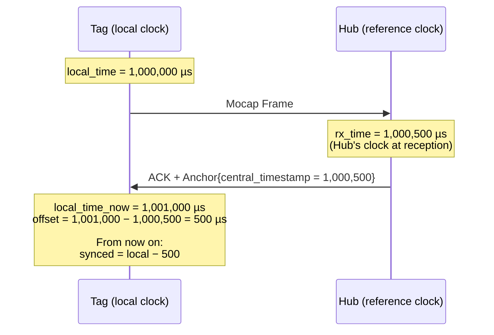
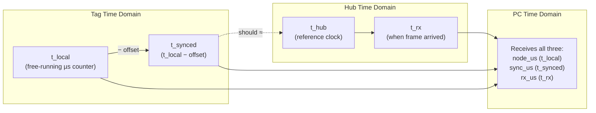
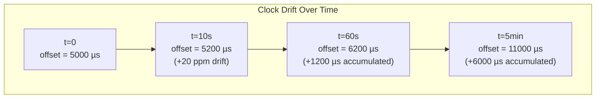
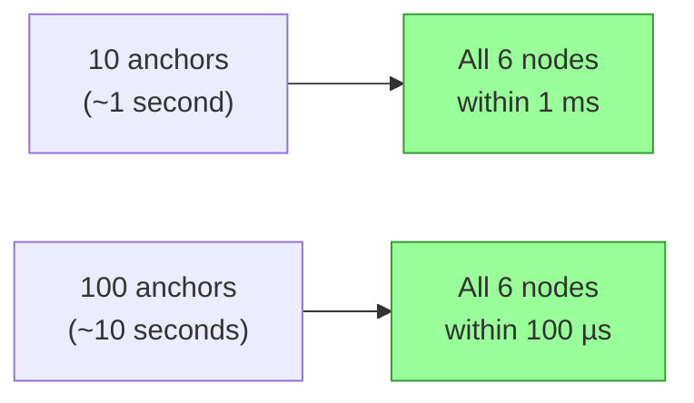
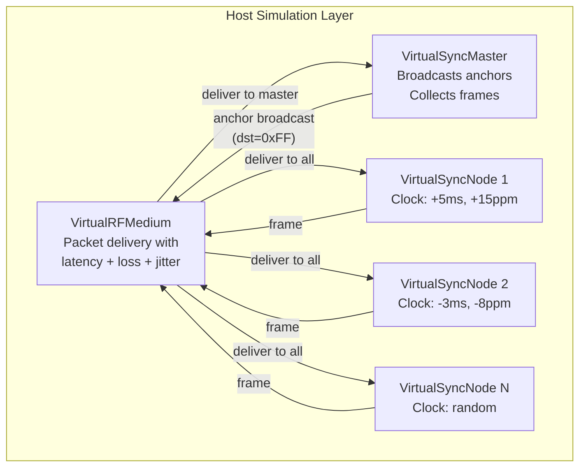
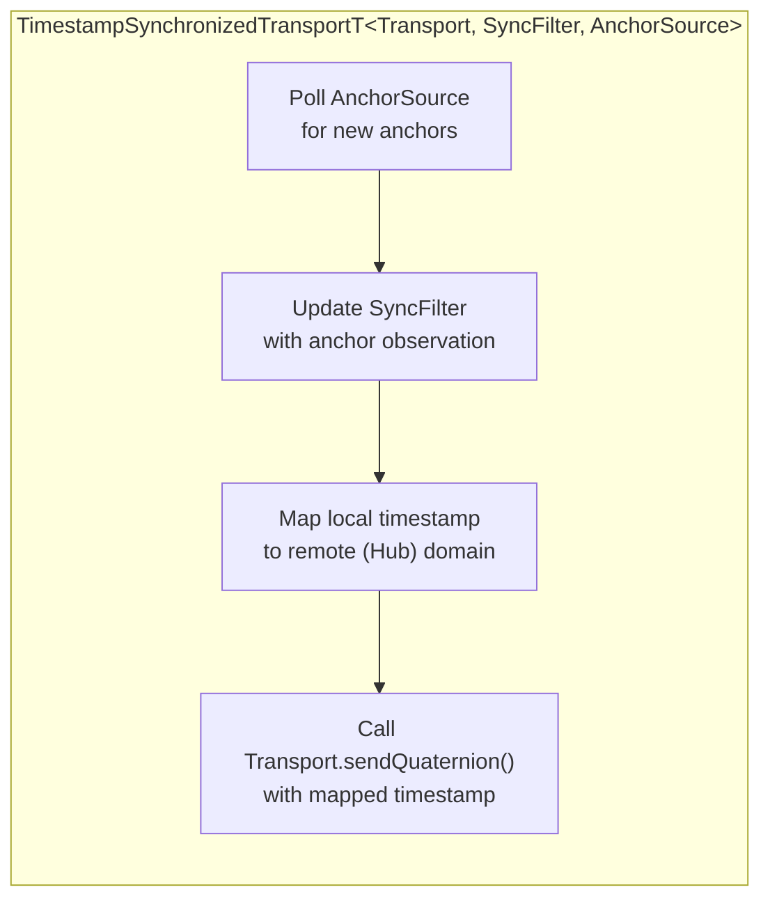
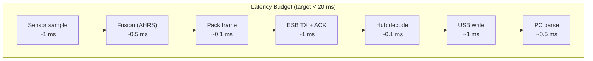

# RF Time Synchronization Deep Dive

> How HelixDrift keeps multiple body-worn Tags aligned to a single Hub
> clock, enabling coherent multi-node mocap reconstruction.
>
> **Prerequisites**: Read [RF Protocol Reference](RF_PROTOCOL_REFERENCE.md)
> first for packet formats and system topology.

---

## 1. The Problem

Each Tag has its own quartz crystal oscillator. Crystals are imperfect:

- **Offset**: At power-on, each Tag's clock starts at a different value
  than the Hub's clock (typically thousands of µs apart).
- **Drift**: Each crystal runs at a slightly different rate — typically
  ±20 ppm (parts per million). Over 1 second, that's ±20 µs of
  accumulated error. Over 1 minute, ±1.2 ms.

If Tags are out of sync, the PC cannot determine the temporal ordering
of sensor readings from different body parts. A wrist sample from
"10 ms ago" might actually be from "25 ms ago" on a drifted clock.

**Target**: Inter-node skew < 1 ms (from `docs/rf-sync-requirements.md`).

---

## 2. The Solution: ACK-Piggybacked Anchor Exchange

HelixDrift uses a **free-riding anchor** approach. The sync information
travels inside the ESB acknowledgment — no extra radio transmissions.



### 2.1 The Offset Calculation

The Tag firmware uses a single line of code:

```c
estimated_offset_us = (int32_t)(local_us - anchor->central_timestamp_us);
```

Where:
- `local_us` = Tag's clock reading at the moment the ACK is processed
- `anchor->central_timestamp_us` = Hub's clock reading at the moment the
  Hub received the Tag's frame

The result `estimated_offset_us` is positive if the Tag's clock is ahead
of the Hub, negative if behind.

### 2.2 Applying the Offset

Every subsequent frame includes a corrected timestamp:

```c
synced_us = local_us - estimated_offset_us;
```

This maps the Tag's local time domain into the Hub's time domain.

### 2.3 What About Propagation Delay?

The offset calculation includes the one-way propagation delay (~500 µs ESB
flight time + processing). This means the synced timestamp is biased by
approximately one round-trip-time / 2. For the current system:

- RF propagation: negligible (speed of light)
- ESB packet time-on-air: ~100 µs at 2 Mbps for 24-byte payload
- Processing: ~100–200 µs
- Total one-way: **~300–500 µs**

This bias is **constant** and affects all Tags equally, so it cancels out
when comparing inter-node timestamps. The PC sees consistent relative
timing between nodes.

---

## 3. Time Domains



| Domain | Symbol | Source | Description |
|--------|--------|-------|-------------|
| Node local time | `t_local` | Tag's `k_uptime_get() × 1000` | Free-running, drifts at ±20 ppm |
| Hub reference time | `t_hub` | Hub's `k_uptime_get() × 1000` | Single truth for the session |
| Synced time | `t_synced` | `t_local − offset` | Tag's estimate of Hub time |
| RX time | `t_rx` | Hub's clock at frame reception | Ground truth for arrival order |

The PC receives `node_us` (t_local), `sync_us` (t_synced), and `rx_us`
(t_rx) on every FRAME line. This lets the host:

1. Use `sync_us` for inter-node alignment
2. Use `rx_us` for Hub-side ordering
3. Compare `sync_us` vs `rx_us` to assess sync quality

---

## 4. Drift and Continuous Correction

### 4.1 Crystal Drift Model



A ±20 ppm crystal drifts ~1.2 ms per minute. Without correction, multi-node
alignment degrades rapidly.

**Correction frequency**: Because anchors ride on every ACK, the offset
estimate is refreshed **on every frame** (50–100 times per second). This is
far more frequent than the drift rate, so drift never accumulates
meaningfully between corrections.

### 4.2 Simulator Clock Model

The simulator (`simulators/rf/ClockModel.hpp`) models this explicitly:

```cpp
struct ClockModel {
    float driftPpm;       // ±20 ppm for crystal, ±2 ppm for TCXO
    uint64_t offsetUs;    // Fixed offset at t=0

    uint64_t mapTrueToLocalUs(uint64_t trueTimeUs) const {
        long double scale = 1.0L + (long double)driftPpm / 1e6L;
        return offsetUs + (uint64_t)(trueTimeUs * scale);
    }

    int64_t offsetAtTrueTimeUs(uint64_t trueTimeUs) const {
        return mapTrueToLocalUs(trueTimeUs) - trueTimeUs;
    }
};
```

Tests use `ClockModel::randomCrystal(20.0f)` to generate Tags with
realistic random drift within ±20 ppm.

---

## 5. Convergence and Accuracy

### 5.1 Single Anchor Convergence

A single anchor exchange is sufficient to establish an offset estimate.
The simulator proves this:


The offset converges in one round-trip because the calculation is a direct
subtraction, not a filter or estimator.

### 5.2 Multi-Node Convergence

Six nodes with random crystal drift (±20 ppm), tested over 10 seconds:



### 5.3 Degradation Under Packet Loss

With 50% packet loss, sync still holds because anchors arrive on every
**successful** ACK. Even at 50% loss, a Tag at 50 Hz still receives
~25 anchors per second — more than enough to track drift.

| Loss Rate | Anchors/sec (at 50 Hz) | Sync Quality |
|-----------|------------------------|-------------- |
| 0% | 50 | < 100 µs error |
| 10% | 45 | < 100 µs error |
| 50% | 25 | < 5 ms error |
| 90% | 5 | Degrades, but recovers when link restores |

### 5.4 Current Hardware Measurements

From the two-node 100 Hz smoke test on real ProPico hardware:

| Metric | 50 Hz | 100 Hz |
|--------|-------|--------|
| Frame rate per node | 49.67 Hz | 98.48 Hz |
| Gaps per 1000 frames | 0.00 | 0.00 |
| Sync delta (min) | 6,000 µs | 0 µs |
| Sync delta (median) | 10,000 µs | 6,000 µs |
| Sync delta (p90) | 12,000 µs | 9,000 µs |
| Sync delta (p99) | 13,000 µs | 10,000 µs |

**Note**: The "sync delta" here measures the difference between `sync_us`
values from two different nodes for temporally adjacent frames. It reflects
both sync accuracy and the natural timing offset between two independently
transmitting Tags.

---

## 6. The Simulation Stack

All sync logic is proven on the host before deployment to hardware.

### 6.1 Architecture



### 6.2 Configurable Impairments

```cpp
struct RFMediumConfig {
    uint32_t baseLatencyUs = 500;     // One-way flight time
    uint32_t jitterMaxUs   = 0;       // Uniform random jitter [0, max]
    float packetLossRate   = 0.0f;    // Bernoulli drop probability
};
```

Additional runtime controls:
- `triggerBurstLoss(durationUs)` — simulate RF interference blackout
- `setPacketLossRate(rate)` — change loss rate mid-test

### 6.3 Key Test Scenarios

| Test | File | What It Proves |
|------|------|----------------|
| Single anchor offset | `test_rf_sync_basic.cpp` | Offset converges within 1 µs from one anchor |
| Six-node convergence | `test_rf_sync_basic.cpp` | All nodes sync within 1 ms after 10 seconds |
| 50% loss degradation | `test_rf_sync_basic.cpp` | Sync holds < 5 ms even with heavy loss |
| Burst blackout recovery | `test_rf_sync_robustness.cpp` | Sync recovers after link blackout |
| Three-node body chain | `test_body_chain_sync.cpp` | Joint angles preserved, skew < 1 ms |
| Anchor gap detection | `test_sync_node_basic.cpp` | Missing anchors counted correctly |

---

## 7. Firmware Sync Integration

### 7.1 TimestampSynchronizedTransport

The common firmware provides a generic template that wraps any transport
with sync logic:



```cpp
template <typename Transport, typename SyncFilter, typename AnchorSource>
class TimestampSynchronizedTransportT {
    template <typename QuaternionT>
    bool sendQuaternion(uint8_t nodeId, uint64_t localTimestampUs,
                        const QuaternionT& q) {
        uint64_t anchorLocal, anchorRemote;
        if (anchorSource_.poll(anchorLocal, anchorRemote)) {
            syncFilter_.observeAnchor(anchorLocal, anchorRemote);
        }
        uint64_t mappedTs = syncFilter_.toRemoteTimeUs(localTimestampUs);
        return transport_.sendQuaternion(nodeId, mappedTs, q);
    }
};
```

This decouples the sync algorithm from the transport and anchor source,
enabling:
- Host testing with mock transports and simulated anchors
- nRF deployment with real ESB transport and hardware anchor reception
- Future: Kalman filter drop-in for `SyncFilter` without changing transport code

### 7.2 Current vs Future Sync Filters

| Filter | Status | Approach |
|--------|--------|----------|
| **Direct subtraction** | ✅ Current (hardware) | `offset = local − anchor_ts` — simple, effective |
| **Exponential moving average** | Planned | Smooth out jitter in offset estimates |
| **Kalman filter** | Planned | Estimate both offset and drift rate for prediction |

The direct subtraction works well because anchors arrive at 50–100 Hz,
making jitter averaging less critical. A Kalman filter would improve
accuracy during packet loss periods by predicting drift.

---

## 8. End-to-End Latency Budget



| Stage | Budget | Notes |
|-------|--------|-------|
| IMU sampling | ~1 ms | Hardware SPI/I2C read |
| Sensor fusion (Mahony AHRS) | ~0.5 ms | Quaternion update |
| Frame packing | ~0.1 ms | Struct fill |
| ESB TX + flight + ACK | ~1 ms | Including retries: up to ~5 ms |
| Hub decoding + gap check | ~0.1 ms | Struct cast + compare |
| USB CDC write | ~1 ms | Buffered UART output |
| PC parsing | ~0.5 ms | Text line parse |
| **Total typical** | **~4–5 ms** | Well within 20 ms budget |
| **Total worst case** (6 retries) | **~8–10 ms** | Still within budget |

---

## Related Documents

- [RF Protocol Reference](RF_PROTOCOL_REFERENCE.md) — packet formats,
  ESB config, USB output format
- [RF/Sync Requirements](rf-sync-requirements.md) — latency budget
  derivation and use case analysis
- [RF/Sync Architecture](rf-sync-architecture.md) — system-level design
- [RF Simulation Spec](RF_SYNC_SIMULATION_SPEC.md) — simulator
  infrastructure specification
- [M8 Mocap Bridge Workflow](M8_MOCAP_BRIDGE_WORKFLOW.md) — build, flash,
  and run the real hardware
